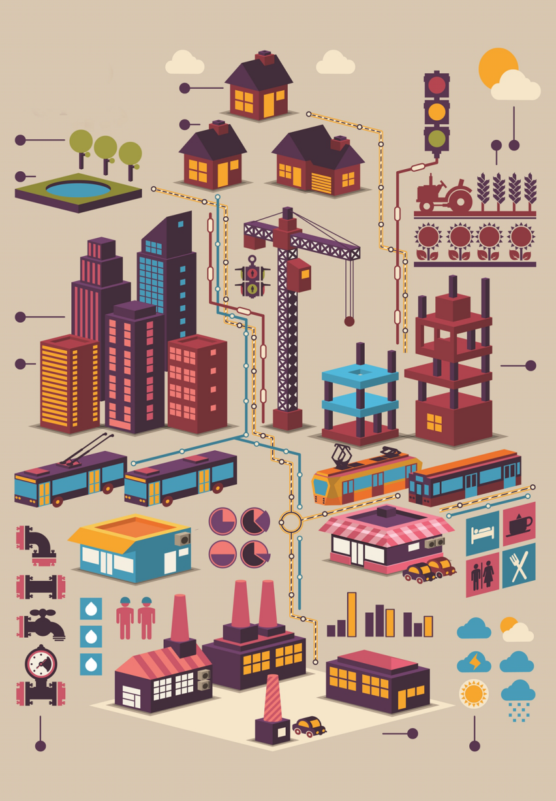
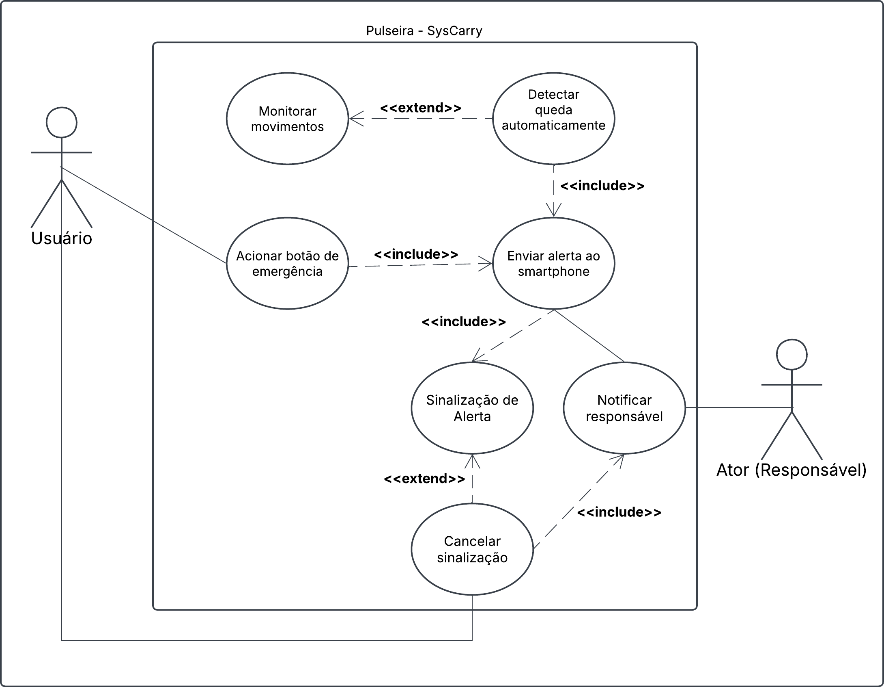
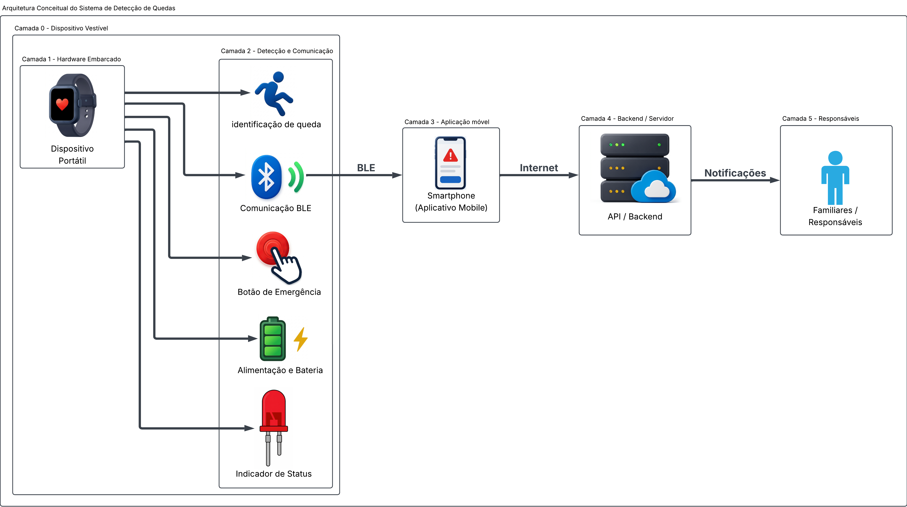

# Etapa 1

**(MÍNIMO DE 600 E MÁXIMO DE 1000 PALAVRAS no total do arquivo md.)**

Na Etapa 1, foi realizado o planejamento fundamental do projeto, iniciando com a pesquisa de soluções existentes e do estado da arte para embasar as decisões técnicas. Em seguida, foram definidos os requisitos do sistema, fazendo uma representação por um diagrama de blocos com os módulos a serem desenvolvidos (*hardaware*, *Firmware*, BLE, App e API) e o diagrama de casos de uso. Por fim, a equipe estabeleceu a concepção da estrutura mecânica, considerando desde o início as restrições de tamanho e os critérios de conforto essenciais para a usabilidade do produto.

## Desenvolvimento

**(Apresentar o desenvolvimento da etapa contendo detalhes de implementação (se houver) de hardware e software. Use fotos, diagramas, tabelas etc. Adicionar pesqusisas realizadas. Relacionar as fotos, diagramas, etc no texto. Todas as referências devem citadas no texto.)**

A Internet das Coisas (IoT) é definida como "uma tecnologia capacitadora que entrega novos casos de uso e serviços em uma ampla variedade de mercados e aplicações" (TEXAS INSTRUMENTS, 2015, p. 1)[1]. Na prática, esse conceito refere-se à conexão e integração de equipamentos, dispositivos e tecnologias à Internet, possibilitando a comunicação, o monitoramento e o gerenciamento contínuo desses elementos. 

Com a crescente expansão desse conceito, a IoT vem sendo amplamente aplicada em diversos setores estratégicos, incluindo a automação residencial, cidades inteligentes (smart cities), indústria, setor automotivo e a área da saúde, conforme ilustrado no panorama da Figura 1. Paralelamente, o avanço da microeletrônica tem possibilitado a redução contínua das dimensões dos componentes eletrônicos, tornando-os significativamente mais compactos, leves e eficientes. Essa tendência de miniaturização é fundamental para viabilizar o desenvolvimento de soluções portáteis e vestíveis, capazes de se integrar à rotina dos usuários sem comprometer sua mobilidade, conforto ou ergonomia.

  
  
Figura 1 - Ecossistema e aplicações da Internet das Coisas (IoT)

Inserido nesse cenário, o monitoramento contínuo da população, principalmente idosos, surge como uma aplicação crítica dos ecossistemas de saúde assistiva, sobretudo em razão da elevada vulnerabilidade a quedas. Segundo Amaral e Coelho (2026)[2], 25,1% dos idosos brasileiros residentes em áreas urbanas sofreram ao menos uma queda durante um período de um ano, correspondendo a aproximadamente um em cada quatro idosos. Para além da possibilidade de lesões físicas, as quedas estão associadas à perda de autonomia, hospitalizações e redução da qualidade de vida. Dessa forma, a identificação rápida de um episódio de queda, alinhada a comunicação imediata com familiares ou responsáveis podem contribuir para que o indivíduo receba assistência em um menor intervalo de tempo, especialmente quando não possui condições de solicitar ajuda por conta própria.

Portanto, este projeto propõe desenvolver um dispositivo vestível portátil, pequeno e de baixo consumo energético, semelhante a um relógio ou pulseira. O sistema busca detectar quedas e incidentes em tempo real, viabilizando o envio automático e imediato de alertas para familiares ou cuidadores responsáveis.

O sistema será desenvolvido considerando dois cenários distintos de operação: dentro e fora da residência. Em ambos os casos, o dispositivo portátil será responsável pela detecção de quedas e situações de emergência, realizando a comunicação com um dispositivo móvel por meio de uma tecnologia de comunicação de baixo consumo de energia, como o Bluetooth Low Energy (BLE). Além desta funcionalidade automática de detecção de queda, ainda tem-se um botão de emergência, com a finalidade de trazer ao usuário uma forma de acionamento manual e imediato, cobrindo cenários em que o algoritmo de detecção automática não identifique a queda ou em que o usuário necessite de auxílio por outro motivo, sem depender exclusivamente do sensoriamento automático.

Segundo dados da Pesquisa Nacional por Amostra de Domicílios Contínua (PNAD Contínua TIC)[3], divulgados pelo Instituto Brasileiro de Geografia e Estatística (IBGE), em 2025, 80,3% das pessoas com 60 anos ou mais possuíam telefone móvel celular para uso pessoal, evidenciando a crescente inserção desse grupo no uso de tecnologias digitais. Diante desse cenário, a utilização do smartphone como dispositivo responsável pelo recebimento dos dados e encaminhamento dos alertas aos familiares ou responsáveis apresenta-se como uma alternativa viável para o sistema proposto. 

Abaixo, na Figura 2, está o diagrama de casos de uso do projeto. Este é utilizado para representar as funcionalidades de um sistema e sua interação com usuários externos, denominados atores (FAKHROUTDINOV, 2026)[4].

  
  
Figura 2 - Diagrama de caso de uso UML

## Diagrama de blocos para implementação do projeto

O diagrama de blocos do sistema foi elaborado com o objetivo de proporcionar uma melhor visualização da integração entre os diferentes módulos que compõem o sistema. A Figura 3 apresenta a organização e a interconexão entre esses módulos, permitindo compreender, de forma simplificada, o fluxo de informações e a relação entre os principais elementos do sistema.

  
  
Figura 3 - Diagrama de blocos do sistema

## Seção Mecânica e Estrutural

A facilidade de vestir e a ergonomia do invólucro fundamentam-se na prevenção do abandono da tecnologia pelo usuário final. Segundo a meta-síntese conduzida por JMIR (2021)[5], a facilidade de uso e a motivação do idoso precisam se sobrepor às barreiras técnicas do dispositivo. Soluções de monitoramento excessivamente complexas, com sistemas de fixação incômodos ou rotinas de recarga difíceis tendem a ser rapidamente abandonadas. Por essa razão, as dimensões físicas e o foram especificados para garantir simplicidade no manuseio diário e máximo conforto tátil.

> Nesta seção, serão abordados os conceitos mecânicos fundamentais que orientam a construção física do dispositivo, incluindo a arquitetura do invólucro, os limites dimensionais e os requisitos ergonômicos.
> 
> 📁 **Documentação Mecânica:** Acesse a pasta: [Mecânica](./mechanics/README.md)

## Referências (links/datasheets/livros)

- [1] [TEXAS INSTRUMENTS. Building the Industrial Internet of Things](https://www.ti.com/lit/ta/ssztcu2/ssztcu2.pdf)

- [2] [CNN Brasil - AMARAL, Lauryn; COELHO, Thomaz. Um em cada quatro idosos brasileiros sofrem ao menos uma queda anualmente](https://www.cnnbrasil.com.br/saude/um-em-cada-quatro-idosos-brasileiros-sofrem-ao-menos-uma-queda-anualmente/)

- [3] [INSTITUTO BRASILEIRO DE GEOGRAFIA E ESTATÍSTICA](https://agenciadenoticias.ibge.gov.br/agencia-noticias/2012-agencia-de-noticias/noticias/47408-proporcao-de-usuarios-da-internet-no-pais-ultrapassou-90-da-populacao-de-10-anos-ou-mais-em-2025.)

- [4] [FAKHROUTDINOV, Kirill. UML use case diagrams](https://www.uml-diagrams.org/use-case-diagrams.html)

- [5] [JMIR mHealth and uHealth. Older Adults' Experiences With Using Wearable Devices: Qualitative Meta-Synthesis](https://pmc.ncbi.nlm.nih.gov/articles/PMC8212622/)

(Talvez isso aqui fique legal de usar)

[⬅️ Introdução](../README.md) | [Etapa 2 ➡️](../etapa_2/)

