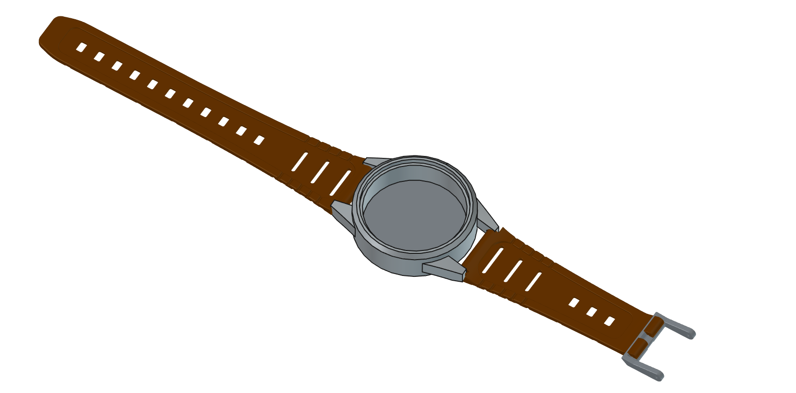

# Etapa 1

Na Etapa 1, foi realizado o planejamento fundamental do projeto, iniciando com a pesquisa de soluções existentes e do estado da arte para embasar as decisões técnicas. Em seguida, foram definidos os requisitos do sistema, fazendo uma representação por um diagrama de blocos com os módulos a serem desenvolvidos (*Hardware*, *Firmware*, BLE, App e API) e o diagrama de casos de uso. Por fim, a equipe estabeleceu a concepção da estrutura mecânica, considerando desde o início as restrições de tamanho e os critérios de conforto essenciais para a usabilidade do produto.

## Desenvolvimento

A Internet das Coisas (IoT) é definida como "uma tecnologia capacitadora que entrega novos casos de uso e serviços em uma ampla variedade de mercados e aplicações" (TEXAS INSTRUMENTS, 2015, p. 1)[1]. Na prática, esse conceito refere-se à conexão e integração de equipamentos, dispositivos e tecnologias à Internet, possibilitando a comunicação, o monitoramento e o gerenciamento contínuo desses elementos. 

Com a expansão da IoT, sua aplicação alcançou setores como automação residencial, cidades inteligentes, indústria, setor automotivo e saúde, conforme ilustrado na Figura 1. Paralelamente, os avanços da microeletrônica têm reduzido as dimensões dos componentes, tornando-os mais compactos, leves e eficientes. Essa miniaturização possibilita o desenvolvimento de soluções portáteis e vestíveis integradas à rotina dos usuários, sem comprometer sua mobilidade, conforto e ergonomia.

  
  
Figura 1 - Ecossistema e aplicações da Internet das Coisas (IoT)

Nesse contexto, o monitoramento contínuo de idosos ou pessoas com enfermidades constitui uma aplicação relevante da saúde assistiva, especialmente devido à vulnerabilidade a quedas. Segundo Amaral e Coelho (2026)[2], 25,1% dos idosos brasileiros residentes em áreas urbanas sofreram ao menos uma queda em um período de um ano, correspondendo a aproximadamente um em cada quatro idosos. Além das lesões físicas, as quedas podem resultar em perda de autonomia, hospitalizações e redução da qualidade de vida, tornando importante a identificação rápida do evento e o acionamento de familiares ou responsáveis.

Diante disso, o projeto propõe o desenvolvimento de um dispositivo vestível portátil, compacto e de baixo consumo energético, semelhante a um relógio ou pulseira, capaz de detectar quedas e situações de emergência e enviar alertas automaticamente. O sistema contempla dois cenários de operação, dentro e fora da residência, utilizando comunicação de baixo consumo, como o Bluetooth Low Energy (BLE), via dispositivo móvel. Além da detecção automática, um botão de emergência permitirá o acionamento manual de auxílio, cobrindo cenários em que o algoritmo de detecção automática não identifique a queda ou em que o usuário necessite de auxílio por outro motivo, sem depender exclusivamente do sensoriamento automático.

Segundo dados da Pesquisa Nacional por Amostra de Domicílios Contínua (PNAD Contínua TIC)[3], divulgados pelo Instituto Brasileiro de Geografia e Estatística (IBGE), em 2025, 80,3% das pessoas com 60 anos ou mais possuíam telefone móvel celular para uso pessoal, evidenciando a crescente inserção desse grupo no uso de tecnologias digitais. Diante desse cenário, a utilização do smartphone como dispositivo responsável pelo recebimento dos dados e encaminhamento dos alertas aos familiares ou responsáveis apresenta-se como uma alternativa viável para o sistema proposto. 

Abaixo, na Figura 2, está o diagrama de casos de uso do projeto. Este é utilizado para representar as funcionalidades de um sistema e sua interação com usuários externos, denominados atores (FAKHROUTDINOV, 2026)[4].

  
  
Figura 2 - Diagrama de caso de uso UML

## Definições do sistema

A partir destas premissas e diagramas será discutida a definição dos sistemas a serem implementados (FW, BLE, App, API)...

## Diagrama de blocos para implementação do projeto

O diagrama de blocos do sistema foi elaborado com o objetivo de proporcionar uma melhor visualização da integração entre os diferentes módulos que compõem o sistema. A Figura 3 apresenta a organização e a interconexão entre esses módulos, permitindo compreender, de forma simplificada, o fluxo de informações e a relação entre os principais elementos do sistema.

  
  
Figura 3 - Diagrama de blocos do sistema

## Seção de Fundamentação para Detecção de Quedas

O estado da arte foi levantado com foco nas principais técnicas utilizadas para detecção automática de quedas, considerando especialmente dispositivos vestíveis baseados em acelerômetros e IMUs. Foram analisadas as características do sinal de aceleração durante uma queda, desde a perda de equilíbrio e o impacto até a imobilidade pós-impacto, além dos principais desafios relacionados à diferenciação entre quedas e atividades cotidianas.

Foram estudadas abordagens baseadas em limiares, máquinas de estados finitos (FSM) e aprendizado de máquina, avaliando seus compromissos entre acurácia, consumo energético e complexidade computacional. Também foram analisadas diferentes posições de sensoriamento, conjuntos de sensores, taxas de amostragem e bases de dados públicas, como o SisFall, além de soluções comerciais como o Apple Watch.

A partir desse levantamento, foi visto como possível estratégia inicial para o protótipo a utilização de uma IMU de 6 eixos associada a uma FSM, utilizando informações de aceleração, giroscópio e inclinação. Essa abordagem apresenta baixo custo computacional e permite validação inicial do sistema, mantendo a possibilidade de evolução futura para modelos leves de aprendizado profundo e TinyML.

> Nesta seção, foram abordados os estudos completos, referências utilizadas, comparação entre abordagens, definições sobre o que indica uma queda e justificativas para as decisões de projeto envolvendo detecção de queda.
> 
> 📁 **Documentação da Fundamentação para Detecção de Quedas:** Acesse o Documento: [Estado da Arte sobre Detecção de Queda](./EstadoDaArte.md)

## Seção Mecânica e Estrutural

A facilidade de vestir e a ergonomia do invólucro fundamentam-se na prevenção do abandono da tecnologia pelo usuário final. Segundo a meta-síntese conduzida por JMIR (2021)[5], a facilidade de uso e a motivação do idoso precisam se sobrepor às barreiras técnicas do dispositivo. Soluções de monitoramento excessivamente complexas, com sistemas de fixação incômodos ou rotinas de recarga difíceis tendem a ser rapidamente abandonadas. Por essa razão, as dimensões físicas e o foram especificados para garantir simplicidade no manuseio diário e máximo conforto tátil.

A concepção mecânica da Pulseira SysCare considera como requisitos principais o conforto, a facilidade de utilização, a fixação adequada ao punho e a integração dos componentes eletrônicos. Foi definido um invólucro de aproximadamente 42 mm de largura e 52 mm de comprimento, integrado a uma pulseira de 18 mm de largura, com fixação por pino de mola. Também foi estabelecida uma massa-alvo inferior a 100 g, visando manter uma estrutura leve para utilização prolongada.

A fabricação preliminar considera a impressão 3D, devido à disponibilidade no IFSC e à flexibilidade para prototipagem e iteração do projeto. Também foram levantados aspectos relacionados ao filamento, contato prolongado com a pele, higienização, acabamento superficial e possíveis efeitos do processo de impressão.

O conceito mecânico desenvolvido é apresentado na Figura 4.

  
  
Figura 4 - Vista isométrica do conceito inicial do dispositivo mecânico integrado com a pulseira 

> Nesta seção, foram abordados os estudos feitos sobre os conceitos mecânicos fundamentais que orientam a construção física do dispositivo, incluindo a arquitetura do invólucro, os limites dimensionais e os requisitos ergonômicos.
> 
> 📁 **Documentação Mecânica:** Acesse a pasta: [Mecânica](./mechanics/README.md)

## Referências (links/datasheets/livros)

- [1] [TEXAS INSTRUMENTS. Building the Industrial Internet of Things](https://www.ti.com/lit/ta/ssztcu2/ssztcu2.pdf)

- [2] [CNN Brasil - AMARAL, Lauryn; COELHO, Thomaz. Um em cada quatro idosos brasileiros sofrem ao menos uma queda anualmente](https://www.cnnbrasil.com.br/saude/um-em-cada-quatro-idosos-brasileiros-sofrem-ao-menos-uma-queda-anualmente/)

- [3] [INSTITUTO BRASILEIRO DE GEOGRAFIA E ESTATÍSTICA](https://agenciadenoticias.ibge.gov.br/agencia-noticias/2012-agencia-de-noticias/noticias/47408-proporcao-de-usuarios-da-internet-no-pais-ultrapassou-90-da-populacao-de-10-anos-ou-mais-em-2025.)

- [4] [FAKHROUTDINOV, Kirill. UML use case diagrams](https://www.uml-diagrams.org/use-case-diagrams.html)

- [5] [JMIR mHealth and uHealth. Older Adults' Experiences With Using Wearable Devices: Qualitative Meta-Synthesis](https://pmc.ncbi.nlm.nih.gov/articles/PMC8212622/)

[⬅️ Introdução](../README.md) | [Etapa 2 ➡️](../etapa_2/)

