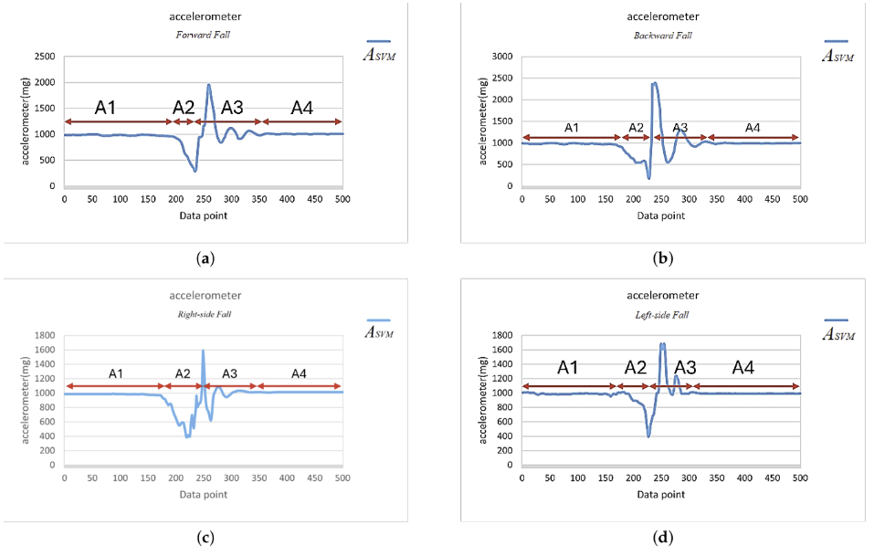
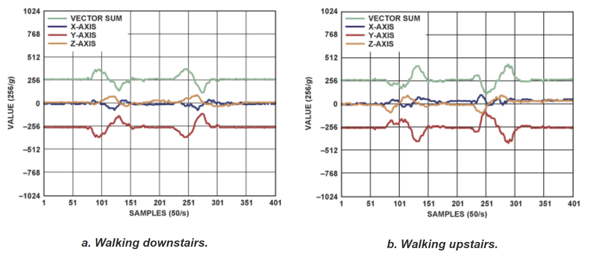
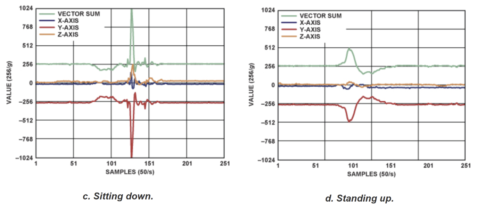

## Estado da arte da detecção de queda

Como já mencionado, a queda é uma das principais causas de lesão e óbito por causas externas entre idosos, quando o socorro não é acionado rapidamente. Por isso, dispositivos vestíveis com detecção automática de queda tornaram-se uma das soluções mais estudadas em saúde digital, com o acelerômetro triaxial em papel central por ser barato, de baixo consumo e dispensar infraestrutura externa. Este texto resume o estado da arte em detecção de queda.

### 1. Introdução e fundamentos do sinal de queda

Quase todos os métodos de detecção partem da mesma observação sobre o sinal de magnitude do vetor de aceleração (SVM) de um corpo em queda. Jia [1] e Tseng, Huang e Kau [2] descrevem quatro fases características dessa curva:
1. Repouso: SVM estável em torno de 1 g;
2. Perda de equilíbrio: queda parcialmente livre, SVM próximo de 0 g;
3. Impacto: pico de aceleração acima de 1,4 g;
4. Imobilidade pós-impacto: sinal se estabiliza numa orientação diferente da inicial.

  
  
Figura 1 - Padrão típico do sinal de queda e as quatro fases do evento.

A principal dificuldade não é detectar o pico de impacto isoladamente — sentar rapidamente, saltar ou descer escadas também o geram —, mas diferenciar a queda real dessas atividades "quase-queda", onde se concentra a maior parte dos falsos positivos [2, 3]. Os exemplos abaixo, de sinais de atividades rotineiras, foram retirados de Jia [1].

  
  
Figura 2 - Sinais de caminhada em acelerometria.

  
  
Figura 3 - Sinais de sentar e levantar em acelerometria.

### 2. Abordagens de análise

A abordagem mais simples compara o SVM a limiares fixos empíricos. Jia [1] ilustra esse paradigma: o ADXL345 possui interrupções de hardware dedicadas (FREE_FALL, ACTIVITY, INACTIVITY) que já implementam parte da lógica no chip, encadeando queda livre, impacto e imobilidade pela orientação dos eixos antes e depois do evento. A vantagem é o baixíssimo consumo e a simplicidade; a limitação é generalizar os limiares entre usuários e tipos de queda.

Uma evolução dessa família é a máquina de estados finitos (FSM), que encadeia critérios de limiar em cascata. O sistema de Tseng, Huang e Kau [2] combina um IMU de seis eixos na cintura com GPS e NB-IoT em cinco estados sequenciais:

1. Queda do SVM abaixo de 0,8 g;
2. Pico de impacto acima de 1,4 g;
3. Estabilização do sinal do acelerômetro e do giroscópio;
4. Mudança do ângulo de inclinação do corpo;
5. Confirmação da queda com envio automático de localização;

Sem aprendizado de máquina, o sistema atingiu sensibilidade de 97,9%, especificidade de 99,9% e acurácia de 99,7%, superando outros algoritmos do próprio estudo — evidência de que uma arquitetura leve pode chegar perto de modelos mais sofisticados com uma fração do custo computacional.

Uma segunda família substitui limiares manuais por classificadores estatísticos — KNN, SVM, árvores de decisão — treinados sobre características extraídas do sinal. Aziz et al. [3] compararam algoritmos de limiar e de aprendizado de máquina e concluíram que os classificadores, sobretudo o SVM, superaram os métodos de limiar em sensibilidade e especificidade combinadas. Redes neurais profundas (CNN, LSTM e híbridos CNN-LSTM) passaram a ser aplicadas diretamente à série temporal bruta, dispensando parte da extração manual de características: Villa e Casilari [4] mostraram que um CNN-LSTM a apenas 20 Hz obteve o melhor equilíbrio entre desempenho (98,9% de acurácia) e eficiência no conjunto público SisFall [5], transmitindo até 80% menos dados do que a 100 Hz. Como esses ganhos exigem mais memória do que um microcontrolador de wearable oferece, a linha TinyML busca comprimir esses modelos para hardware ultra-low-power: Tian, Mercier e Paolini [6] implementaram uma CNN rasa numa FPGA de poucos miliampères, obtendo 86,6% de acurácia.

### 3. Hardware e influência da mecânica no sinal

A posição do sensor também importa: Özdemir [7], referência usada por Tseng, Huang e Kau [2], comparou seis posições em 14 participantes e concluiu que a cintura é a mais eficaz (98,42% de acurácia), por ficar próxima do centro de massa e sofrer menos artefatos do que punho ou cabeça. A fusão de acelerômetro com giroscópio já é padrão nos sistemas mais recentes [2, 3, 4], e alguns trabalhos somam um barômetro para antecipar o alerta pela variação de altura; o sistema de Tseng, Huang e Kau [2] soma ainda GPS/GNSS e NB-IoT, para que o evento identificado se traduza em socorro efetivo.

Bases públicas como o SisFall [5] permitem treinar e comparar algoritmos sem depender de coleta própria: reúne 2.706 atividades diárias e 1.798 quedas simuladas por 23 jovens e 15 idosos, registradas com um ADXL345, o mesmo componente descrito por Jia [1]. Um achado relevante é que algoritmos treinados só com dados de jovens perdem sensibilidade em sinais de idosos, pois o padrão e a velocidade de queda diferem entre faixas etárias. No mercado, a detecção de queda do Apple Watch combina acelerômetro e giroscópio, reconhecendo o padrão rotacional do pulso em vez de um limiar fixo, mas tem desempenho baixo para cadeirantes, cujo padrão foge do perfil ambulatorial para o qual o algoritmo foi ajustado [8].

### 4. Tecnologias mais promissoras

Considerando acurácia, consumo e viabilidade de implementação, as tecnologias mais promissoras são: um IMU de 6 eixos na cintura como base sensorial; uma FSM sobre limiares de SVM, giroscópio e ângulo de inclinação como algoritmo inicial, por exigir baixo custo computacional e já entregar desempenho próximo do estado da arte; um CNN-LSTM leve a taxas reduzidas (cerca de 20 Hz), como evolução para reduzir falsos positivos em "quase-quedas"; TinyML para viabilizar esse modelo em hardware ultra-low-power; e conectividade e localização (GPS/GNSS com NB-IoT ou BLE), já que o valor do dispositivo depende de transformar a detecção em socorro efetivo.

Em suma, a detecção de queda por acelerômetro é uma linha de pesquisa madura, com progressão de limiares simples até o aprendizado profundo embarcado — a escolha depende do compromisso entre acurácia, energia e complexidade. Para o protótipo, a estratégia mais eficiente é começar por uma FSM com IMU de 6 eixos na cintura, replicável a partir de Tseng, Huang e Kau [2], evoluindo para modelos leves de aprendizado profundo ou TinyML conforme necessário.

## Referências (links/datasheets/livros)

- [1] [JIA, N. Detecting Human Falls with a 3-Axis Digital Accelerometer](https://www.analog.com/en/resources/analog-dialogue/articles/detecting-falls-3-axis-digital-accelerometer.html) — Analog Dialogue, v. 43, jul. 2009.

- [2] [TSENG, C.-K.; HUANG, S.-J.; KAU, L.-J. Wearable Fall Detection System with Real-Time Localization and Notification Capabilities](https://doi.org/10.3390/s25123632) — Sensors, v. 25, n. 12, art. 3632, 2025.

- [3] [AZIZ, O.; MUSNGI, M.; PARK, E. J.; MORI, G.; ROBINOVITCH, S. N. A comparison of accuracy of fall detection algorithms (threshold-based vs. machine learning)](https://doi.org/10.1007/s11517-016-1504-y) — Medical & Biological Engineering & Computing, v. 55, n. 1, p. 45-55, 2017.

- [4] [VILLA, M.; CASILARI, E. The Impact of the Accelerometer Sampling Rate on the Performance of Machine and Deep Learning Models in Wearable Fall-Detection Systems](https://doi.org/10.3390/s26010162) — Sensors, v. 26, n. 1, art. 162, 2026.

- [5] [SUCERQUIA, A.; LÓPEZ, J. D.; VARGAS-BONILLA, J. F. SisFall: A Fall and Movement Dataset](https://doi.org/10.3390/s17010198) — Sensors, v. 17, n. 1, art. 198, 2017.

- [6] [TIAN, J.; MERCIER, P.; PAOLINI, C. Ultra low-power, wearable, accelerated shallow-learning fall detection for elderly at-risk persons](https://doi.org/10.1016/j.smhl.2024.100498) — Smart Health, v. 33, art. 100498, 2024.

- [7] [ÖZDEMIR, A. T. An Analysis on Sensor Locations of the Human Body for Wearable Fall Detection Devices: Principles and Practice](https://doi.org/10.3390/s16081161) — Sensors, v. 16, n. 8, art. 1161, 2016.

- [8] [WEARABLEBEAT. Apple Watch Fall Detection: How to Set Up, How It Works & What to Expect](https://wearablebeat.com/articles/apple-watch-fall-detection-setup-guide/) — 2026. Acesso em: 30 ago. 2026. (Fonte técnica/comercial secundária, não revisada por pares.)
