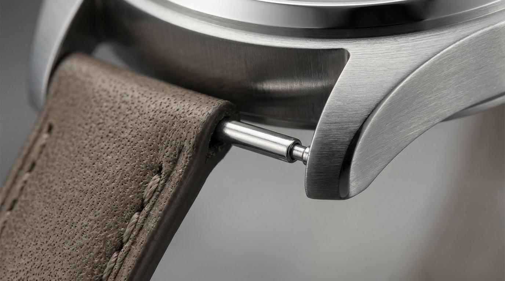

# Mecânica

Nesta seção são apresentados os conceitos mecânicos adotados para o desenvolvimento da Pulseira SysCare, considerando as restrições dimensionais, ergonômicas, de massa, seleção de materiais e mecanismos de fixação. As decisões de projeto foram estabelecidas buscando conciliar a acomodação dos componentes eletrônicos com requisitos de conforto, resistência mecânica e possibilidade de utilização contínua.

### Restrições de tamanho e conforto do dispositivo

O desenvolvimento de um dispositivo vestível (*wearable*) voltado ao uso cotidiano, exige rigor na definição de suas especificações físicas e ergonômicas. A adesão ao uso contínuo do sistema depende diretamente do nível de conforto do equipamento, evitando que a estrutura cause incômodo, lesões ou rejeição por parte do usuário, como já comentado anteriormente.

Dessa forma, foram estabelecidas inicialmente restrições relacionadas às dimensões externas, massa, geometria da carcaça, contato com a pele e sistema de fixação. Essas restrições serão posteriormente verificadas durante a etapa de prototipagem e validação do dispositivo.

#### Restrições dimensionais e de massa

As dimensões externas da carcaça devem proporcionar espaço suficiente para a acomodação da PCB, bateria, sensores e demais componentes, mantendo, simultaneamente, um formato compacto para utilização no punho. Nesta etapa são estabelecidos os **critérios** que governam essas dimensões e um esboço geométrico de partida, e não cotas definitivas: os valores só podem ser fechados quando os componentes internos estiverem selecionados.

Em relação à massa, não existe uma classificação universalmente padronizada para o peso de relógios. Entretanto, referências especializadas da indústria relojoeira utilizam faixas aproximadas para caracterizar a percepção de peso. Segundo a Chronos Japan[1], relógios com massa de até aproximadamente 50 g podem ser considerados leves, enquanto aqueles próximos de 100 g são classificados como de peso normal e modelos próximos de 200 g são considerados pesados. A mesma referência destaca que relógios mais leves tendem a proporcionar maior conforto durante períodos prolongados de utilização.

Com base nessa referência, e considerando que a Pulseira SysCare se destina ao uso contínuo, o projeto orienta-se por manter o conjunto completo — carcaça, PCB, bateria, sensores e pulseira — dentro da faixa que essa classificação descreve como leve a normal. Nenhum valor de massa é fixado nesta etapa: a massa só poderá ser estimada de forma realista após a definição da PCB, da bateria e do material da carcaça, e será verificada por medição do protótipo.

Outro ponto relevante é a interferência com vestimentas: mangas de camisas e punhos de roupas são pontos comuns de atrito para dispositivos vestíveis de pulso, o que reforça a necessidade de um perfil de baixo relevo (*low-profile*) na carcaça, já que roupas são sempre um fator a considerar, havendo conflito entre mangas e punhos de camisa e o dispositivo vestível no pulso.

#### Conforto e interação com o usuário

Além das dimensões absolutas, a geometria da superfície em contato com o usuário deve ser considerada. As regiões da carcaça próximas à pele devem possuir transições suaves e ausência de arestas pronunciadas, reduzindo a possibilidade de pontos de pressão e atrito durante o uso.

A pulseira deverá permitir ajuste suficiente para acomodar diferentes dimensões de punho, mantendo o dispositivo firmemente posicionado sem exercer compressão excessiva. Esse aspecto é particularmente importante para o sistema de detecção de quedas, uma vez que o movimento relativo entre a pulseira e o punho pode alterar o comportamento dos sensores inerciais.

Assim, o projeto busca estabelecer um compromisso entre fixação adequada e liberdade de movimento, evitando tanto uma pulseira excessivamente frouxa quanto uma fixação que gere desconforto ao usuário.

### Medidas Físicas 

A definição das dimensões mecânicas e dos mecanismos de fixação do dispositivo fundamenta-se em parâmetros antropométricos e padrões da indústria de relojoaria, que pode ser vista na Figura 1 [2].

  
  
Figura 1 - Diagrama de referência para cotas de caixas (Largura da caixa vs. Comprimento de caixa)

#### Dimensionamento Antropométrico e Geometria da Caixa

O comprimento da caixa, medido entre as extremidades das garras, é limitado pela largura do pulso (distância transversal do punho). Segundo a norma ABNT NBR ISO 7250-1 (2010)[3], que estabelece as medidas básicas do corpo humano para o projeto técnico, e as diretrizes antropométricas aplicadas à engenharia de Iida e Buarque (2016), a largura do pulso em adultos e idosos apresenta uma variação típica entre 48 mm (percentil 5% feminino) e 65 mm (percentil 95% masculino). O critério de projeto adotado é que o comprimento da caixa não ultrapasse o limite inferior dessa faixa, de modo que a peça permaneça assentada sobre o dorso do pulso mesmo nos punhos menores, sem enganchar em roupas ou tecidos. O esboço geométrico de partida trabalha próximo desse limite, valor a ser confirmado quando as dimensões da PCB e da bateria estiverem fechadas.

A largura da caixa, no eixo horizontal, é orientada pelo padrão unissex comercial de relógios e *smartwatches*, faixa em que o corpo do dispositivo permanece centralizado no dorso do pulso sem gerar desconforto. A largura final resultará do confronto entre duas exigências opostas: a área interna precisa acomodar a placa de circuito impresso, a bateria, a IMU e a antena, enquanto o conforto e a discrição pedem a menor caixa possível.

O fechamento dessa dimensão depende, portanto, do leiaute da PCB e do formato da bateria, ainda não definidos. Esta etapa registra o critério de decisão e o esboço geométrico de partida, apresentado na Figura 2; o dimensionamento da área interna disponível será feito na etapa de desenvolvimento, quando houver componentes reais a acomodar.

  
  
Figura 2 - Esboço geométrico preliminar (sketch 2D) com as restrições dimensionais do invólucro

#### Interface da Pulseira e Mecanismo de Fixação 

A largura de encaixe da pulseira será tomada entre os valores padronizados pelo mercado relojoeiro, sendo a faixa de 18 mm a 22 mm a de maior disponibilidade comercial. Adotar um valor padronizado distribui a carga do dispositivo de forma homogênea, reduzindo a pressão pontual sobre a epiderme, e permite a substituição por pulseiras comerciais facilmente encontradas, conforme ilustrado na Figura 3. A largura exata acompanhará a dimensão final da caixa.

  
  
  
Figura 3 - Exemplo de pulseira comercial de 18 mm de largura com mecanismo de fixação por pino de mola

O sistema de fixação previsto utiliza furos cegos nas garras, dimensionados para receber um pino de mola comercial. Esse pino consiste em um tubo cilíndrico metálico contendo uma mola interna que projeta duas hastes retráteis, tipicamente entre 0,8 mm e 1 mm de diâmetro. A força de expansão contínua da mola mantém o travamento mecânico do conjunto no fundo do furo, impedindo o desacoplamento involuntário da pulseira. As cotas dos furos serão definidas a partir do pino efetivamente adquirido.

Esse mecanismo foi escolhido devido à sua simplicidade, baixo volume, facilidade de montagem e ampla disponibilidade comercial.

#### Materiais e biocompatibilidade

O invólucro da Pulseira será realizada por manufatura aditiva, utilizando impressão 3D, disponível no IFSC. Dessa forma, a seleção do material deve considerar não somente as propriedades mecânicas necessárias à fabricação da carcaça, mas também os efeitos associados ao contato prolongado da peça com a pele do usuário.

Embora materiais como PLA, PETG e ABS sejam amplamente utilizados em processos de impressão 3D, a composição do filamento comercial não é determinada exclusivamente pelo polímero base, mas também corantes, plastificantes, estabilizantes e outros aditivos podem alterar as propriedades químicas e biológicas da peça final.

O dispositivo, por se tratar de um dispositivo em contato direto e prolongado com a pele, a seleção de materiais deve seguir critérios de biocompatibilidade reconhecidos internacionalmente, como a norma ISO 10993. A série de normas ISO 10993 pode ser utilizada como referência para a avaliação biológica de materiais destinados ao contato com o corpo humano, considerando-se o tipo e a duração desse contato.

Estudos indicam que a impressão 3D pode resultar na emissão de partículas e compostos orgânicos voláteis, sendo necessárias medidas de controle para reduzir a exposição durante o processo de fabricação (KHOSHAKHLAGH et al., 2025)[4]. Entre os materiais avaliados na literatura encontram-se PLA, ABS, PETG e TPU, sendo observadas diferenças significativas nas emissões conforme o tipo de polímero, temperatura de processamento e características específicas do filamento. Em particular, estudos comparativos indicam emissões geralmente superiores para ABS em relação ao PLA, embora o comportamento dependa das condições de impressão e da formulação comercial utilizada.

Para a fabricação do protótipo da Pulseira SysCare, deverá ser priorizado um filamento comercial de composição conhecida, fornecido por fabricante identificado e acompanhado de ficha técnica. Como medida adicional, recomenda-se que o protótipo seja projetado com superfícies arredondadas e acabamento adequado, reduzindo regiões de concentração de pressão e irregularidades capazes de favorecer o acúmulo de suor e partículas. A possibilidade de higienização da superfície também deve ser considerada, uma vez que o dispositivo será utilizado durante períodos prolongados.

Por fim, devem ser considerados modelos de validação mecânica e funcional. A utilização de um determinado filamento no protótipo não constitui, por si só, comprovação de biocompatibilidade ou adequação para uso contínuo na pele. Uma eventual versão destinada à utilização prolongada deverá utilizar materiais devidamente caracterizados para essa finalidade e, quando aplicável, submetidos às avaliações biológicas pertinentes.

### Resultado

A Figura 4 ilustra a modelagem mecânica parcial do dispositivo, representando a meta de validação mecânica e estética estabelecida para esta primeira etapa do projeto.

  
  
  
  
Figura 4 - Vista isométrica, vista superior do dispositivo mecânico e integração com a pulseira

## Referências (links/datasheets/livros)

- [1] [HIROTA, Masayuki. How to choose a quality watch / What to look for when buying a watch?](https://en.webchronos.net/selection/11556/)

- [2] [Guia Completo de Medidas para Relógios](https://www.orit.com.br/blog/guia-completo-de-medidas-para-relogios?srsltid=AfmBOorhcDAND2YLGPD7Oo2gHNTxI-yhP63j3Upb1gQy8Xe9hmq36VTI)

- [3] [INTERNATIONAL ORGANIZATION FOR STANDARDIZATION. ISO 7250-1:2017: Basic human body measurements for technological design — Part 1: Body measurement definitions and landmarks.](https://www.iso.org/obp/ui/#iso:std:iso:7250:-1:ed-2:v1:en)

- [4] [KHOSHAKHLAGH, A. H. et al. A global evaluation of exposure to pollutants in 3D printing: A systematic review and meta-analysis. Journal of Hazardous Materials Advances, 2025.](https://www.sciencedirect.com/science/article/pii/S2772416625003420)