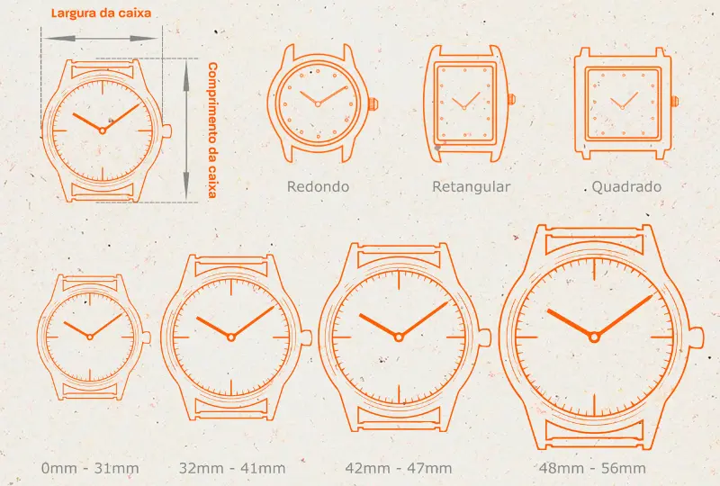
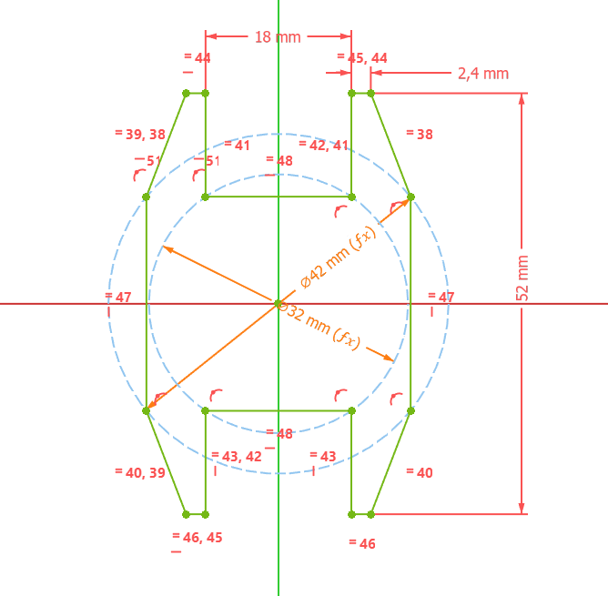
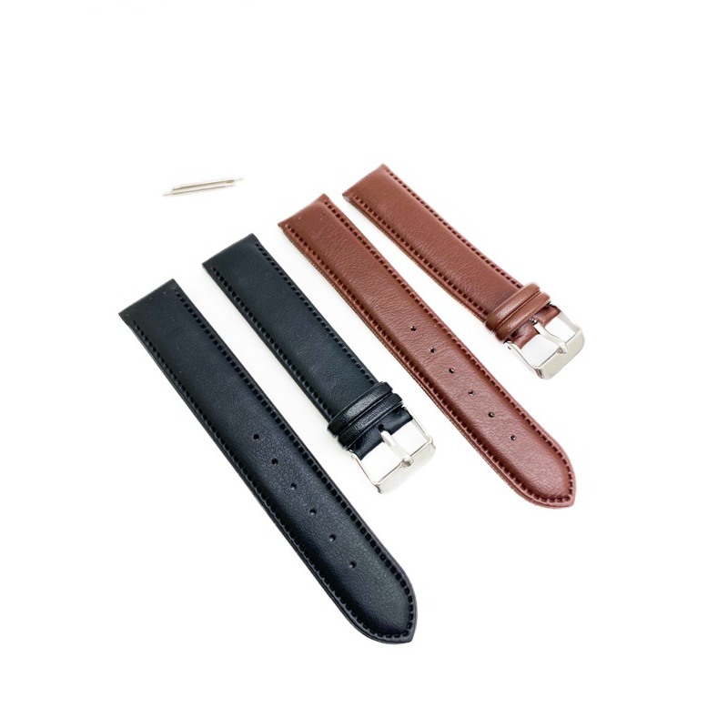
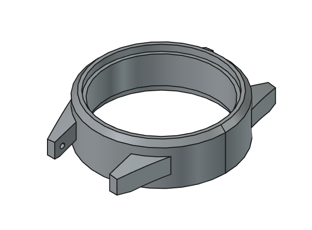
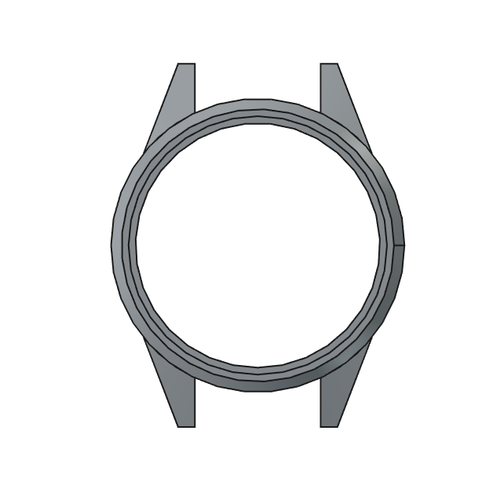
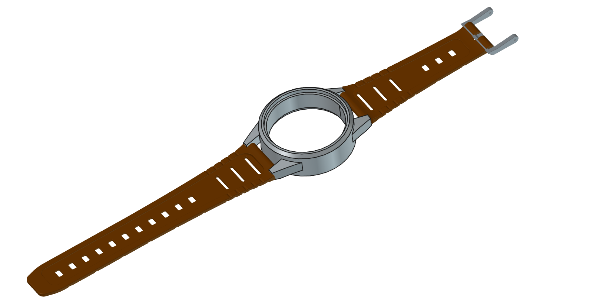

# Mecânica

Nesta seção, serão discutidos os conceitos mecânicos iniciais que norteiam o desenvolvimento do dispositivo, bem como as justificativas técnicas e antropométricas para as dimensões adotadas no projeto.

### Restrições de tamanho e conforto do dispositivo

O desenvolvimento de um dispositivo vestível (*wearable*) voltado ao uso cotidiano, exige rigor na definição de suas especificações físicas e ergonômicas. A adesão ao uso contínuo do sistema depende diretamente do nível de conforto do equipamento, evitando que a estrutura cause incômodo, lesões ou rejeição por parte do usuário, como já comentado anteriormente.

Portanto, abaixo serão apresentados os levantamentos e restrições iniciais do dispositivo:
- Restrições Dimensionais e de Massa
- Materiais e Biocompatibilidade 
 (MELGORAR TUDO ISSO AQUI PQ NAO TA LEGAL)

### Restrições de tamanho e conforto do dispositivo

O desenvolvimento de um dispositivo vestível (*wearable*) voltado ao uso cotidiano exige rigor na definição de suas especificações físicas e ergonômicas. A adesão ao uso contínuo do sistema depende diretamente do nível de conforto do equipamento, evitando que a estrutura cause incômodo, lesões ou rejeição por parte do usuário, como já comentado anteriormente.

Portanto, a seguir serão apresentados os levantamentos e restrições iniciais do dispositivo.

#### Restrições dimensionais e de massa

O projeto mecânico do invólucro deve considerar a ampla variação antropométrica dos usuários. A prática padrão de design ergonômico recomenda que o dispositivo seja dimensionado para atender de forma confortável desde o percentil 5 (perfil feminino) até o percentil 95 (perfil masculino) da população-alvo, garantindo ajuste adequado sem folgas excessivas nem compressão do punho do usuário.

Em relação à massa, dispositivos vestíveis comparáveis — como *armbands* e pulseiras de reconhecimento de movimento com sensores embarcados — costumam variar entre aproximadamente 30 g e 100 g, dependendo da quantidade de sensores e da capacidade da bateria. Como referência, sistemas com um conjunto reduzido de sensores conseguem atingir massas próximas de 32,5 g, enquanto dispositivos com módulos de sensoriamento mais robustos ultrapassam os 90 g , como observado em bandas eletrônicas com sensor reduzido em torno de 32,5 g, contra dispositivos comparáveis que chegam a 78 g e 96 g com sensoriamento mais completo. Para a Pulseira SysCarry, isso sugere uma massa-alvo na faixa de 30–50 g, de modo a manter o dispositivo leve o suficiente para uso contínuo (incluindo durante o sono, se esse for um cenário de uso previsto), sem comprometer a autonomia da bateria.

Outro ponto relevante é a interferência com vestimentas: mangas de camisas e punhos de roupas são pontos comuns de atrito para dispositivos vestíveis de pulso, o que reforça a necessidade de um perfil de baixo relevo (*low-profile*) na carcaça , já que roupas são sempre um fator a considerar, havendo conflito entre mangas e punhos de camisa e o dispositivo vestível no pulso.

#### Materiais e biocompatibilidade

Por se tratar de um dispositivo em contato direto e prolongado com a pele, a seleção de materiais deve seguir critérios de biocompatibilidade reconhecidos internacionalmente, como a norma **ISO 10993**, que trata da avaliação biológica de dispositivos médicos e é aplicável também a *wearables* de contato cutâneo. Os ensaios mais relevantes para esse tipo de produto são a citotoxicidade (ISO 10993-5), a sensibilização cutânea (ISO 10993-10) e a irritação (ISO 10993-23), que juntos avaliam se o material provoca reações alérgicas, toxicidade celular ou irritação na pele do usuário , sendo os testes de citotoxicidade, sensibilização/irritação e toxicidade sistêmica os mais comuns exigidos para materiais de contato prolongado com a pele.

Como referência para os materiais da carcaça e da correia, silicone de grau médico e TPU (poliuretano termoplástico) certificados conforme ISO 10993 são amplamente utilizados em dispositivos vestíveis por serem hipoalergênicos e não irritantes em uso contínuo , já que filamentos de TPU flexível certificados garantem que o material não causa reações alérgicas ou irritação de pele, tornando-o seguro para dispositivos vestíveis em contato direto com a pele. Recomenda-se ainda evitar o contato de componentes metálicos (parafusos, contatos de carregamento) com níquel exposto, optando por acabamentos hipoalergênicos, e priorizar materiais resistentes a suor e umidade, já que a resistência à transpiração é um requisito frequente em dispositivos de monitoramento contínuo.

### Medidas Físicas 

A definição das dimensões mecânicas e dos mecanismos de fixação do dispositivo fundamenta-se em parâmetros antropométricos e padrões da indústria de relojoaria, que pode ser vista na Figura 1 [1].

  
  
Figura 1 - Diagrama de referência para cotas de caixas (Largura da caixa vs. Comprimento de caixa)

#### Dimensionamento Antropométrico e Geometria da Caixa

O comprimento da caixa de 52 mm (distância total entre as extremidades das garras) foi projetado com base nos dados de largura do pulso (distância transversal do punho). Segundo a norma ABNT NBR ISO 7250-1 (2010)[2], que estabelece as medidas básicas do corpo humano para o projeto técnico, e as diretrizes antropométricas aplicadas à engenharia de Iida e Buarque (2016), a largura do pulso em adultos e idosos apresenta uma variação típica entre 48 mm (percentil 5% feminino) e 65 mm (percentil 95% masculino). A dimensão adotada de 52 mm garante que a caixa permaneça assentada sobre o dorso do pulso sem ultrapassar a largura total do pulso, prevenindo que a estrutura enganche em roupas ou tecidos.

Em conformidade também com a ABNT NBR ISO 7250-1 (2010)[2], a largura da caixa foi estabelecida em 42 mm no eixo horizontal, dimensão que se enquadra no padrão unissex comercial de relógios e *smartwatches*. Essa medida disponibiliza uma área interna circular útil de 32 mm de diâmetro. A área da seção transversal disponível para acomodação dos componentes é calculada por:

$$A = \pi \cdot r^2 = \pi \cdot (32\text{ mm}/2)^2 \approx 804,25\text{ mm}^2$$

Esse espaço fornece o volume necessário para acomodar a Placa de Circuito Impresso (PCB), o acelerômetro, a antena BLE e a bateria. Portanto a largura de 42 mm mantém o corpo do dispositivo centralizado no dorso do pulso, garantindo volume interno suficiente sem gerar desconforto no dorço do pulso.

  
  
Figura 2 - Esboço geométrico cotado (sketch 2D) com as restrições e dimensões do invólucro

#### Interface da Pulseira e Mecanismo de Fixação 

A escolha da largura de encaixe de 18 mm distribui a carga e o peso do dispositivo de forma homogênea, reduzindo a pressão pontual sobre a epiderme. Além disso, trata-se de um valor padronizado de mercado, permitindo a substituição por pulseiras comerciais facilmente encontradas, conforme ilustrado na Figura 3.

  
  
Figura 3 - Exemplo de pulseira comercial de 18 mm de largura com mecanismo de fixação por pino de mola

O sistema de fixação utiliza furos cegos de 1,5 mm de diâmetro por 1,5 mm de profundidade posicionados nas garras. O pino de mola convencional consiste em um tubo cilíndrico metálico contendo uma mola interna que projeta duas hastes retráteis de 0,8 mm a 1 mm para fora. A força de expansão contínua da mola mantém o travamento mecânico do conjunto no fundo do furo cego das garras, impedindo o desacoplamento involuntário da pulseira.

#### Materiais e Considerações de Biocompatibilidade

### Resultado

A Figura 4 ilustra a modelagem mecânica parcial do dispositivo, representando a meta de validação mecânica e estética estabelecida para esta primeira etapa do projeto.

  
  
  
  
Figura 4 - Vista isométrica, vista superior do dispositivo mecânico e integração com a pulseira

## Referências (links/datasheets/livros)

- [1] [Guia Completo de Medidas para Relógios](https://www.orit.com.br/blog/guia-completo-de-medidas-para-relogios?srsltid=AfmBOorhcDAND2YLGPD7Oo2gHNTxI-yhP63j3Upb1gQy8Xe9hmq36VTI)

- [2] [INTERNATIONAL ORGANIZATION FOR STANDARDIZATION. ISO 7250-1:2017: Basic human body measurements for technological design — Part 1: Body measurement definitions and landmarks.](https://www.iso.org/obp/ui/#iso:std:iso:7250:-1:ed-2:v1:en)