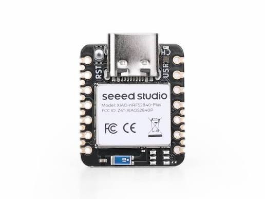
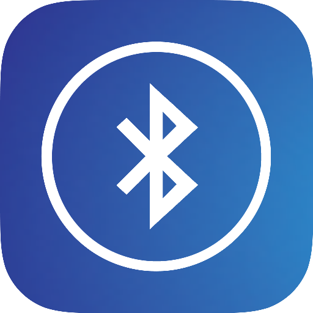

# Etapa 2

A etapa 2 ...

**(Adicionar aqui UM parágrafo com visão geral da etapa. Resumo dos itens da planilha.)**

## Desenvolvimento

### Componentes selecionados

Após a análise dos requisitos e a comparação entre as alternativas disponíveis, foram definidos os principais componentes para a implementação do primeiro protótipo. A seleção considerou tanto as características elétricas e funcionais dos componentes quanto fatores relacionados à disponibilidade, facilidade de integração e restrições dimensionais da pulseira.

A Tabela 1, apresenta os componentes selecionados para o protótipo e suas respectivas funções no sistema. Todo o estudo e seleção, bem como os benchmarks feitos estão localizados no *README.md* na pasta *Hardware*.

> Nesta seção, foram detalhadas as escolhas dos componentes para o protótipo inicial, bem como o esquemático da PCI. Todas as considerações e comparações podem ser vistas no documento.
>
> 📁 **Documentação de *Hardware*:** Acesse a pasta: [Hardware](./hardware/README.md)

| **Categoria** | **Componente** | **Figura** | **Função** | **Critério de seleção** |
|:---:|:---:|:---:|:---|:---|
| **Microcontrolador** | Seeed Studio XIAO nRF52840 |  | Processamento, controle do sistema e comunicação BLE | Plataforma compacta, BLE integrado e facilidade de prototipagem |
| **Acelerômetro** | TDK InvenSense IIM-42351 |  | Aquisição de aceleração e detecção de queda | Módulo disponível, conhecimento prévio e Free-fall Detection |
| **Bateria** | CR2032 |  | Alimentação do sistema | Dimensões reduzidas e disponibilidade |
| **Comunicação** | Bluetooth Low Energy |  | Comunicação com o smartphone | Baixo consumo e integração ao XIAO nRF52840 |

  
Tabela 1 - Definição dos componentes do sistema

A escolha dos componentes apresentada na Tabela 1, corresponde à configuração utilizada para a validação do primeiro protótipo. Após a validação da arquitetura e do funcionamento do sistema, poderão ser avaliadas alternativas com foco na redução do consumo energético e na integração dos componentes em uma placa dedicada.

---
## Definição dos softwares necessários (FW, HW, MEC, APP) 

Para o desenvolvimento da Pulseira SysCare, foram definidos softwares específicos para cada uma das etapas do projeto, abrangendo o desenvolvimento do firmware (FW), projeto eletrônico (HW), desenvolvimento mecânico (MEC) e aplicativo (APP). A seleção considera as ferramentas utilizadas para programação, simulação, desenvolvimento das placas eletrônicas e modelagem da estrutura física do dispositivo.

| **Etapa**            | **Software**                    | **Aplicação no projeto**                                                                              |
| -------------------- | ------------------------------- | ----------------------------------------------------------------------------------------------------- |
| **FW - Firmware**    | Visual Studio Code + nRF Connect NORDIC | Desenvolvimento, compilação e gerenciamento do firmware do XIAO nRF52840.                             |
| **HW - Hardware**    | Altium Designer                 | Desenvolvimento do esquemático e projeto da placa de circuito impresso (PCI).                         |
| **MEC - Mecânica**   | FreeCAD                 | Modelagem tridimensional e desenvolvimento da estrutura mecânica da pulseira e de seu encapsulamento. |
| **APP - Aplicativo** |                                 |                                                                                                       |

## Referências (links/datasheets/livros)

- [1] 

