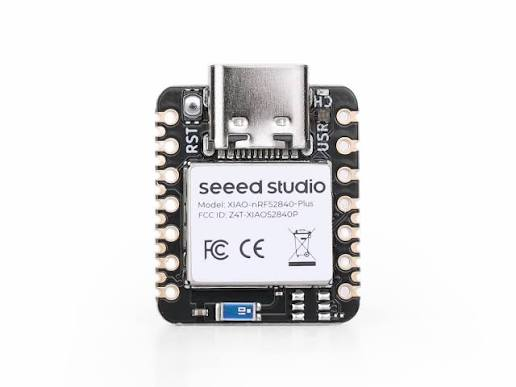
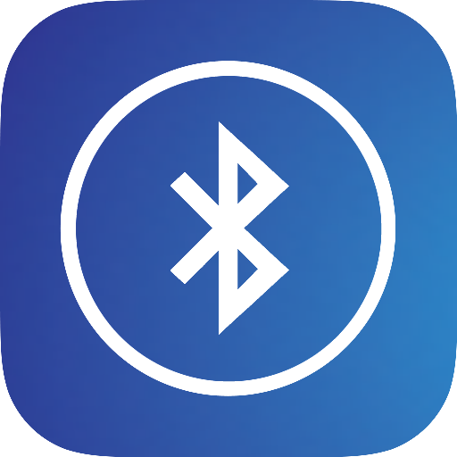
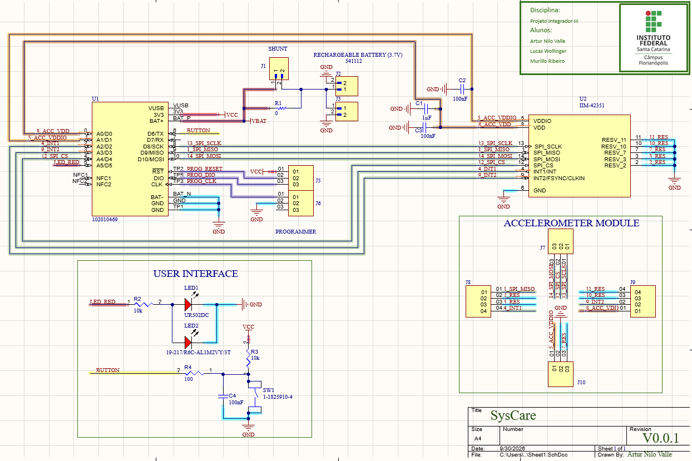
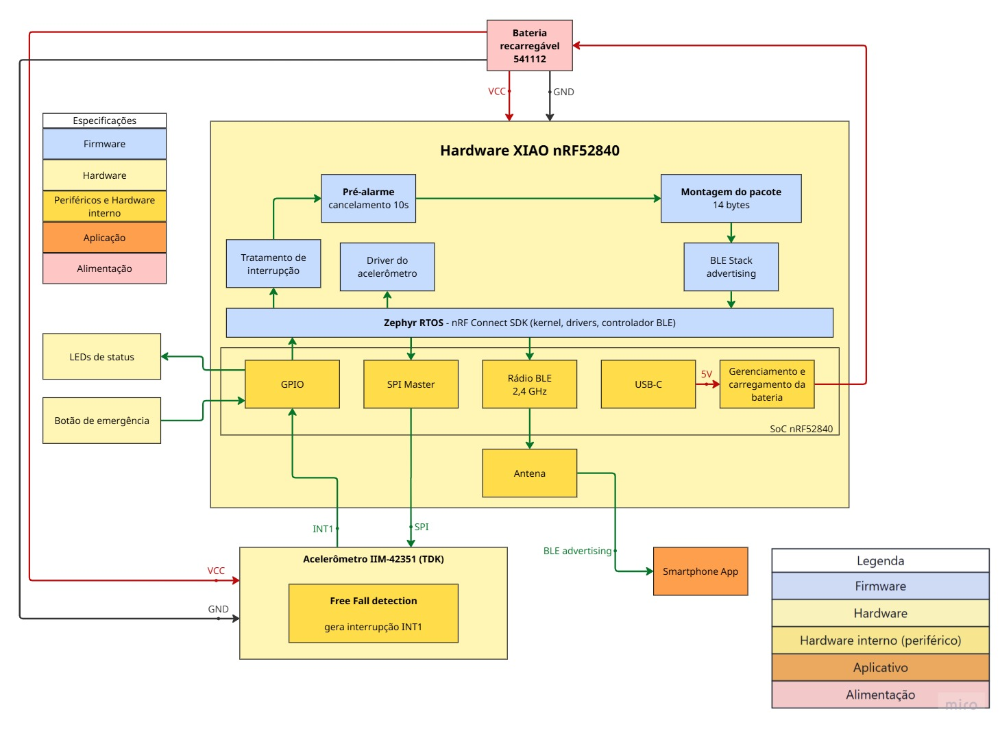
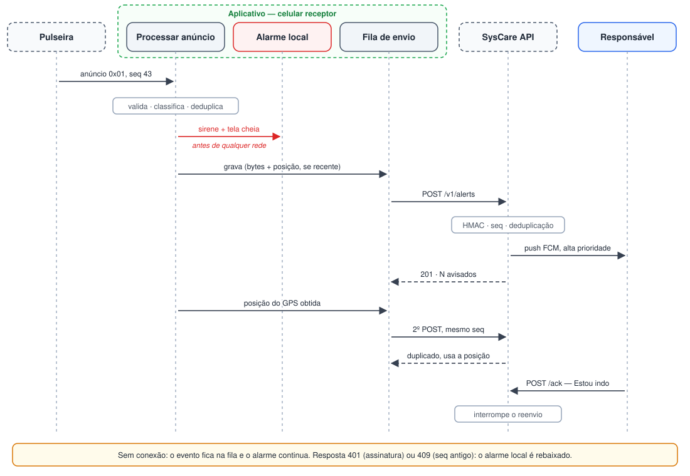
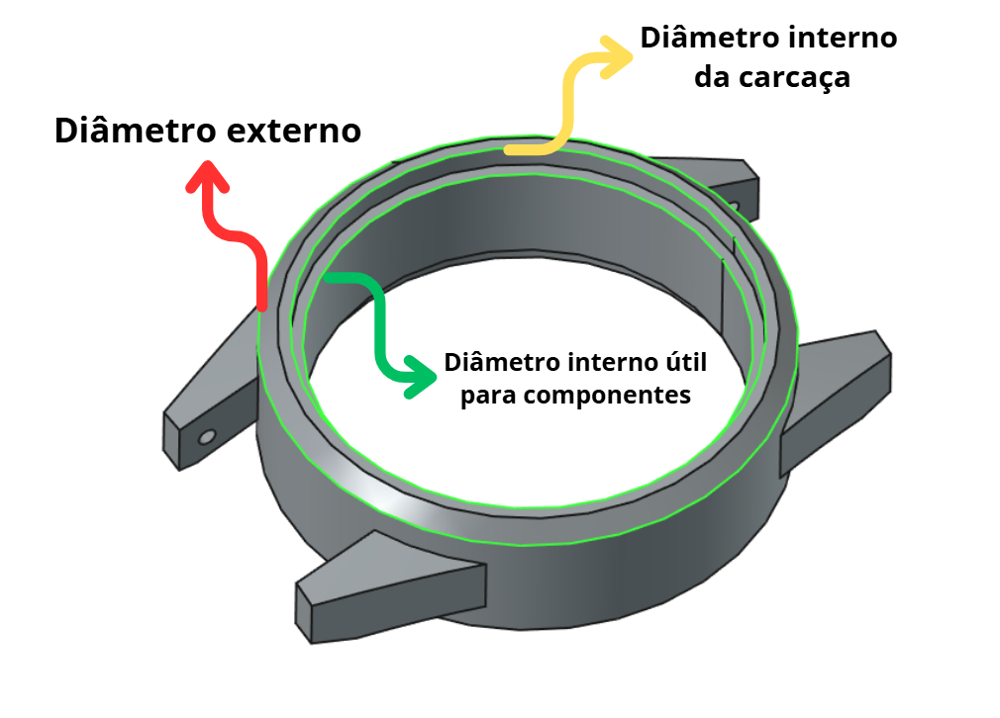
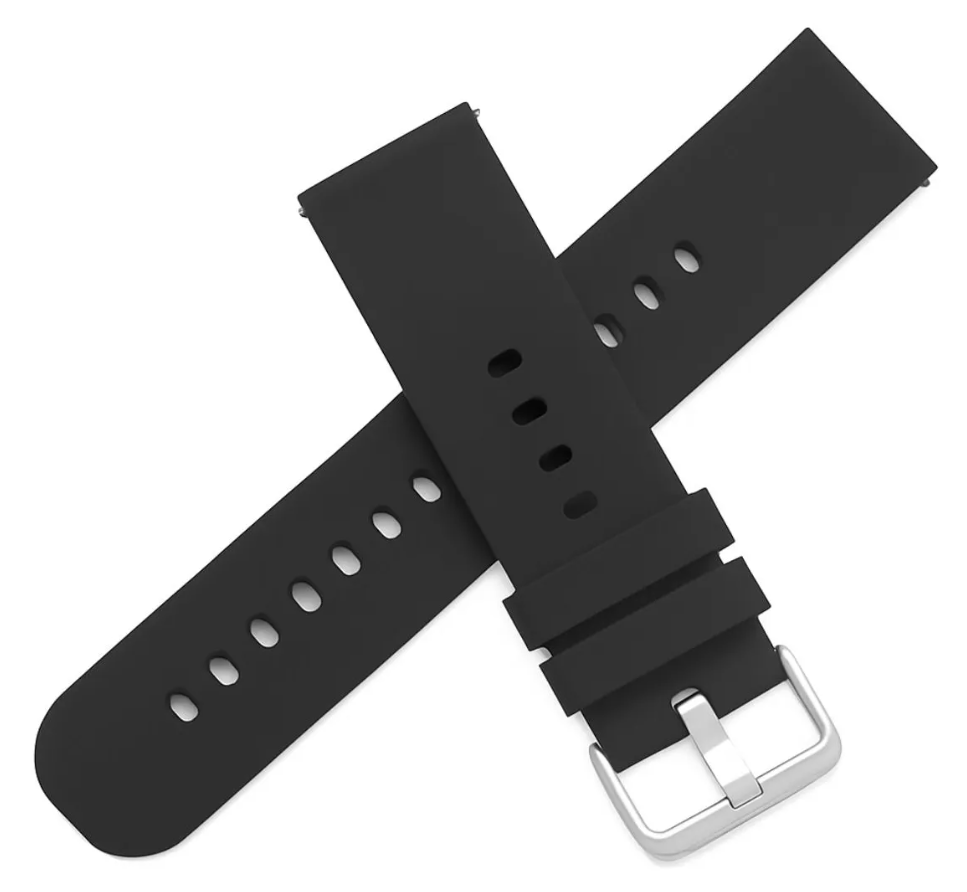
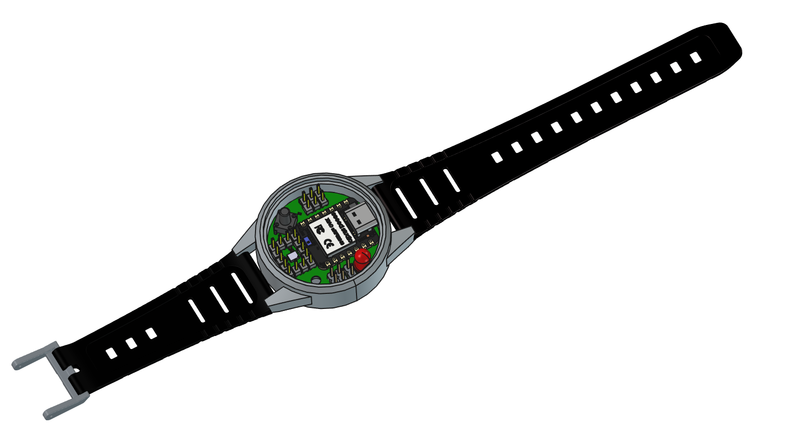

# Etapa 2

A etapa 2 corresponde ao desenvolvimento do primeiro protótipo da Pulseira SysCare e à definição de sua arquitetura nas áreas de *hardware*, *firmware*, aplicativo, API e mecânica. Nesta etapa, foram selecionados os componentes, definidas as ferramentas de desenvolvimento, elaborados o esquemático e a arquitetura do *firmware*, implementados o aplicativo e a API responsáveis por receber e repassar os alertas, e desenvolvido o projeto mecânico da carcaça. Este documento resume cada frente; o detalhamento está nos documentos indicados ao final de cada seção.

### Definição dos *softwares* necessários para o projeto

Para cada área do projeto, foi definida uma ferramenta de desenvolvimento, considerando a programação, o projeto da placa eletrônica e a modelagem da estrutura física do dispositivo, conforme a Tabela 1.

| **Etapa**            | **Software**                    | **Aplicação no projeto**                                                                              |
| -------------------- | ------------------------------- | ----------------------------------------------------------------------------------------------------- |
| **FW - Firmware**    | Visual Studio Code + nRF Connect NORDIC | Desenvolvimento, compilação e gerenciamento do firmware do XIAO nRF52840.                             |
| **HW - Hardware**    | Altium Designer                 | Desenvolvimento do esquemático e projeto da placa de circuito impresso (PCI).                         |
| **MEC - Mecânica**   | FreeCAD                 | Modelagem tridimensional e desenvolvimento da estrutura mecânica da pulseira e de seu encapsulamento. |
| **APP - Aplicativo** | Flutter (Dart) + Visual Studio Code + Android Studio | Desenvolvimento do aplicativo; o Android Studio fornece o Android SDK e o emulador para compilar e testar o APK. |
| **API**              | Python + FastAPI                | Servidor que recebe os eventos, guarda o histórico e notifica os responsáveis.                        |

  
Tabela 1 - Definição dos <i>softwares</i> do projeto

---

## Desenvolvimento de *Hardware*

### Componentes selecionados

Os componentes do primeiro protótipo, apresentados na Tabela 2, foram escolhidos considerando as características elétricas e funcionais, a disponibilidade, a facilidade de integração e as restrições dimensionais da pulseira. Trata-se de uma configuração voltada à validação da arquitetura: após os testes, poderão ser avaliadas alternativas de menor consumo e a integração dos componentes em uma placa dedicada.

| **Categoria** | **Componente** | **Figura** | **Função** | **Critério de seleção** |
|:---:|:---:|:---:|:---|:---|
| **Microcontrolador** | Seeed Studio XIAO nRF52840 |  | Processamento, controle do sistema e comunicação BLE | Plataforma compacta, BLE integrado e facilidade de prototipagem |
| **Acelerômetro** | TDK InvenSense IIM-42351 |  | Aquisição de aceleração e detecção de queda | Módulo disponível, conhecimento prévio e Free-fall Detection |
| **Bateria** | Bateria recarregável 541112 |  | Alimentação do sistema | Dimensões reduzidas e disponibilidade |
| **Comunicação** | Bluetooth Low Energy |  | Comunicação com o smartphone | Baixo consumo e integração ao XIAO nRF52840 |

  
Tabela 2 - Definição dos componentes do sistema

> 📁 **Documentação de *Hardware*:** comparativos e critérios de seleção dos componentes em [Hardware](./hardware/README.md)

### Desenvolvimento do esquemático

O esquemático, apresentado na Figura 1, foi desenvolvido no Altium Designer e armazenado no Altium 365. Por se tratar do primeiro protótipo, ele prioriza a flexibilidade de montagem e a facilidade de depuração. O circuito de carregamento integrado ao XIAO nRF52840 permitiu adotar a bateria recarregável 541112, com recarga pela porta USB, e entre a bateria e o módulo foi previsto um ponto para medição do consumo. Os sinais da interface SWD foram disponibilizados para depuração do *firmware*. O acelerômetro IIM-42351 se comunica via SPI e utiliza os pinos de interrupção para acordar o microcontrolador, podendo ser soldado na placa ou conectado como módulo avulso. A interface com o usuário é composta por um LED de indicação e um botão de emergência com *debounce* em *hardware*.

  
  
Figura 1 - Esquemático completo da Pulseira SysCare

> 📁 **Documentação do esquemático:** circuitos, decisões de projeto e lista de materiais em [Esquemático](./hardware/schematics/README.md)

---

## Desenvolvimento de *Software* e *Firmware*

### Firmware

A detecção de quedas utiliza o recurso interno de *Freefall Detection* do IIM-42351, configurado a 25 Hz para operar em modo de baixo consumo, conforme a Tabela 3. Ao identificar uma queda livre, o acelerômetro gera uma interrupção pela linha INT1, e o XIAO nRF52840 confirma o evento verificando o impacto e a imobilidade posteriores antes de emitir o alerta.

| Parâmetro | Configuração |
|---|---|
| **Acelerômetro** | IIM-42351 |
| **Accel ODR** | 25 Hz |
| **DMP ODR** | 25 Hz |
| **Freefall Detection** | Low Power |
| **Detecção inicial** | Freefall Detection interno |
| **Saída da detecção** | Interrupção para o MCU |
| **Processamento posterior** | Impacto + imobilidade -> (se necessário) |
| **MCU** | XIAO nRF52840 |

  
Tabela 3 - Proposta inicial de configuração do acelerômetro

O *firmware* será desenvolvido sobre o Zephyr RTOS / nRF Connect SDK e organizado em módulos de detecção e confirmação de quedas, tratamento de interrupções, comunicação SPI com o acelerômetro, gerenciamento de energia, armazenamento de dados e comunicação BLE, conforme a Figura 2.

  
  
Figura 2 - Diagrama de blocos da arquitetura de <i>hardware</i> e <i>firmware</i> da Pulseira SysCare

A pulseira não mantém conexão com o celular: ela transmite anúncios BLE (*advertising*) de 14 bytes, assinados com HMAC, contendo o tipo do evento, um número de sequência, o nível da bateria e a intensidade do impacto. Em repouso, envia um *heartbeat* a cada 2 s; em uma emergência, repete o anúncio a cada 100 ms. Como qualquer celular próximo pode receber o anúncio, o alerta não depende de um aparelho pareado.

> 📁 **Documentação do *Firmware*:** [Firmware](./software/firmware/README.md) · **Protocolo BLE:** [ble_payload.md](./software/api/docs/ble_payload.md)

### Aplicativo

O aplicativo foi desenvolvido em Flutter e atende a dois papéis. O **receptor**, exclusivo do Android devido às restrições do iOS à varredura BLE em segundo plano, escuta a pulseira, dispara o alarme local e repassa o evento à API. O **responsável**, disponível em Android e iOS, recebe a notificação, confirma o atendimento e gerencia as pulseiras e os demais responsáveis. O código é dividido em cinco camadas, com as regras do protocolo isoladas em um pacote Dart puro, testado com os mesmos vetores de bytes gerados pela API.

A principal decisão da arquitetura é que o alarme local precede qualquer acesso à rede, como mostra a Figura 3. A sirene toca assim que o anúncio é classificado como emergência; em seguida, o aplicativo envia SMS aos responsáveis pelo plano do próprio celular, obtém a localização e envia o evento à API por meio de uma fila persistente, que não descarta eventos em caso de falha de rede. O protótipo foi instalado em um celular Android físico, e o envio de SMS foi validado de ponta a ponta.

  
  
Figura 3 - Sequência do alerta no aplicativo, do anúncio à confirmação

> 📁 **Documentação do Aplicativo:** [Aplicativo](./software/app/README.md)

### API

A API é um servidor em Python (FastAPI) que recebe os eventos repassados pelo aplicativo, guarda o histórico e notifica os responsáveis. Três decisões orientam sua implementação: a **deduplicação**, pois vários celulares podem reportar o mesmo anúncio e a API gera um único alerta por número de sequência, aproveitando a localização de qualquer um deles; a **verificação da assinatura** HMAC, que impede que um rádio próximo forje uma queda; e o **escalonamento**, que reenvia o alerta periodicamente enquanto nenhum responsável confirmar o atendimento. As notificações são enviadas por *push* (Firebase Cloud Messaging) e, quando há provedor contratado, por SMS. O levantamento de custos dos canais de alerta levou à adoção do SMS enviado pelo próprio celular como canal principal de SMS, já que os provedores de SMS por API são pagos.

> 📁 **Documentação da API:** [API](./software/api/README.md) · **Canais de alerta:** [canais_de_alerta.md](./software/api/docs/canais_de_alerta.md)

---

## Desenvolvimento mecânico

O projeto mecânico, que cobria os requisitos dimensionais, ergonômicos e de fabricação na Etapa 1, foi definido e prototipado em uma carcaça compacta, com 42 mm de largura e 52 mm de comprimento total, incluindo as garras de fixação. O diâmetro interno é de 37 mm, e a região útil de 35 mm, com cerca de 962,11 mm², é a referência para o posicionamento da PCI, da bateria e do acelerômetro, como mostra a Figura 4. As dimensões estão resumidas na Tabela 4.

| Parâmetro | Valor |
|---|---:|
| Largura externa da carcaça | **42 mm** |
| Comprimento total da carcaça | **52 mm** |
| Diâmetro interno da carcaça | **37 mm** |
| Diâmetro interno útil | **35 mm** |
| Largura da pulseira | **18 mm** |
| Área interna útil de referência | **962,11 mm²** |
| Sistema de fixação | **Pino de mola** |

  
Tabela 4 - Dimensões mecânicas definidas

  
  
Figura 4 - Dimensões dos diâmetros externo, interno e da região útil da carcaça da Pulseira SysCare

A carcaça é fixada a uma pulseira comercial de silicone de 18 mm, apresentada na Figura 5[REFERENCIAR], por meio de pinos de mola (*spring bars*), escolhidos pela simplicidade construtiva, pelo pequeno volume e pela facilidade de montagem. A distância inicial de 2,5 mm entre a extremidade da garra e o centro do furo do pino será ajustada após a validação com a pulseira física.

 
   
  
Figura 5 - Pulseira de silicone Wawe de 18 mm
 

A carcaça será fabricada por impressão 3D com o filamento disponível no IFSC, o que permite alterar a geometria ao longo do desenvolvimento. Em versões futuras, o material será reavaliado quanto ao contato prolongado com a pele. A estimativa de massa do conjunto, apresentada na Tabela 5, será completada após a fabricação da carcaça e da PCI. A Figura 6 apresenta o modelo 3D da pulseira com a PCI integrada.

| Componente                           | Massa estimada (g) |
| ------------------------------------ | -----------------: |
| Estrutura da pulseira impressa em 3D |                  7 |
| Bateria                              |                  2 |
| Acelerômetro IIM-42351               |                  1 |
| Microcontrolador XIAO nRF52840       |                4,7 |
| PCI                                  |                  7 |
| **Massa total estimada**             |              **21,7** |

  
Tabela 5 - Estimativa da massa total

 
   
  
Figura 6 - Projeto 3D com protótipo da PCI integrada
 

> 📁 **Documentação de Mecânica:** dimensionamento, fixação, material e massa em [Mecânica](./mechanics/README.md)

## Referências

FAZER TODAS AS REFERENCIASSSS

- [XX] [High-performance 3-Axis SmartIndustrial™ Accelerometer MEMS Device for Industrial Applications](https://product.tdk.com/system/files/dam/doc/product/sensor/mortion-inertial/accelero/data_sheet/ds-000441-iim-42351-typ-v1.2.pdf)

- [XX] [Pulseira 22mm Silicone Wawe Para Relogio Smartwatch C/ Pinos Cor Preta - Mercado Livre](https://www.mercadolivre.com.br/pulseira-22mm-silicone-wawe-para-relogio-smartwatch-c-pinos-cor-preta/p/MLB27101261?pdp_filters=seller_id%3A554440847#polycard_client=recommendations_pdp-seller_items-above&reco_backend=ranker-retsys-same-seller&reco_model=fallback_same-seller&reco_client=pdp-seller_items-above&reco_item_pos=0&reco_backend_type=low_level&reco_id=53201d97-38cf-43e9-8262-48ce6e3023e8&wid=MLB3449594979&sid=recos)

