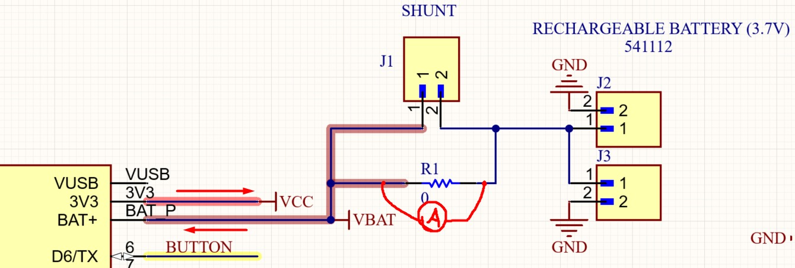
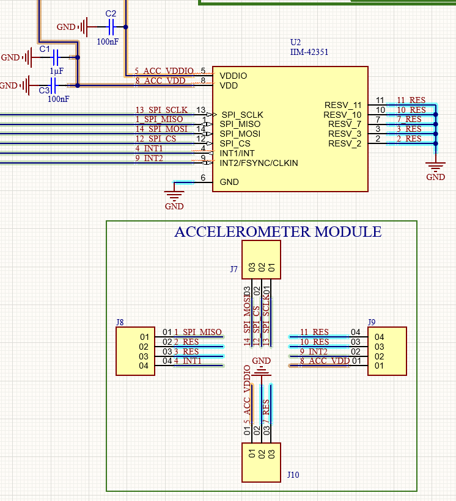
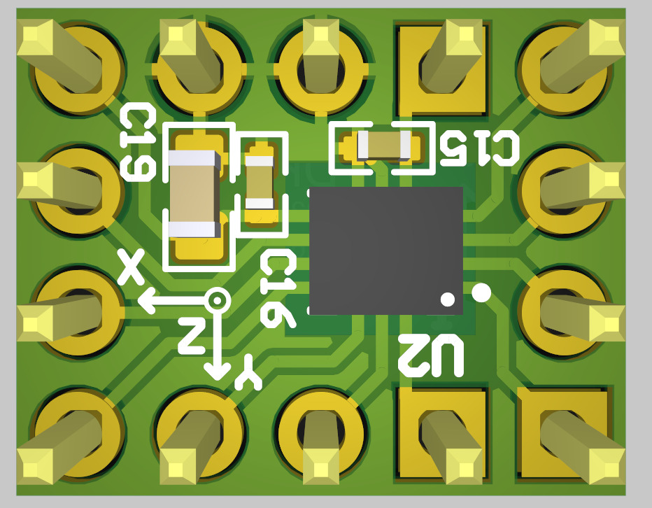
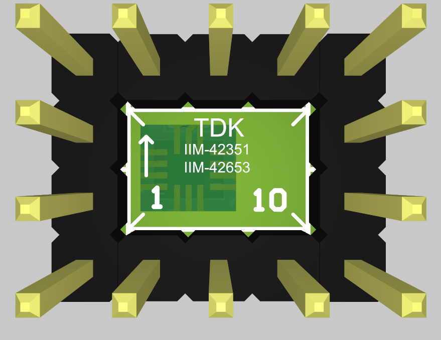
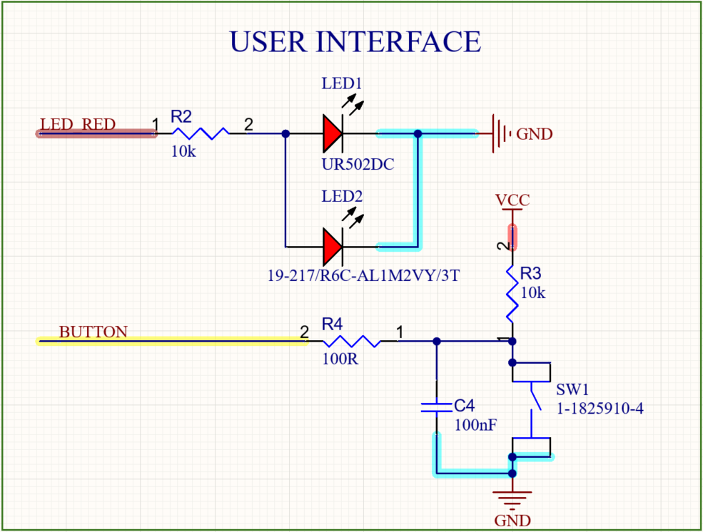

# Esquemático

A partir da definição dos componentes principais apresentada na [seleção de componentes](../README.md) — microcontrolador, acelerômetro e bateria —, foi desenvolvido o esquemático eletrônico da Pulseira SysCare utilizando o software **Altium Designer**. O projeto foi criado e armazenado na nuvem do **Altium 365**, o que permite o versionamento do projeto e o acesso compartilhado entre os integrantes da equipe. O projeto está disponível em:

- **Projeto no Altium 365:** https://artur-nilo-valle.365.altium.com/designs/BF7CEE4B-8527-4C6F-BEBC-60C0F28CAC33
- **Esquemático (PDF):** [SysCare_schematic.PDF](./SysCare_schematic.PDF)

O objetivo desta etapa é consolidar, em um único documento eletrônico, as decisões tomadas durante a seleção dos componentes e detalhar como cada bloco funcional do sistema é interligado. Como o primeiro protótipo é voltado à validação da arquitetura, o esquemático foi elaborado priorizando a flexibilidade de montagem: sempre que possível, foram previstas alternativas de montagem (SMD ou PTH) e pontos de acesso que facilitam a depuração e a caracterização do consumo energético.

  
  
Figura 1 - Esquemático completo da Pulseira SysCare

## Módulo microcontrolador e alimentação

A primeira etapa após a criação do projeto foi a seleção e a inserção dos componentes na biblioteca do projeto. Inicialmente, foi localizado e adicionado o módulo **XIAO nRF52840**, da Seeed Studio, representado no esquemático pelo componente **U1**. Em seguida, foi analisado o esquemático oficial do módulo, disponibilizado pelo fabricante [1], com o objetivo de identificar quais recursos já estão implementados internamente e quais precisariam ser adicionados à placa da pulseira.

Durante essa análise, verificou-se que o módulo já possui um **circuito de carregamento de bateria de lítio integrado**, acessível pelos pinos `BAT+` e `BAT-`, com a recarga realizada diretamente pela interface USB do próprio módulo. Essa constatação motivou uma alteração em relação à proposta inicial do projeto: originalmente havia sido considerado o uso de baterias fixas de lítio de 3 V, que exigiriam um sistema de troca de células e proteções adicionais. Com o circuito de carga já disponível no módulo, optou-se pela utilização de uma **bateria recarregável de polímero de lítio (modelo 541112, 3,7 V / 50 mAh)**, descrita na seleção de componentes. Essa decisão elimina a necessidade de um carregador externo dedicado, reduz a quantidade de componentes na placa e torna o dispositivo mais seguro e prático para o usuário, já que a recarga passa a ser feita pela própria porta USB.

A bateria é conectada à placa pelos conectores **J2** e **J3**. Entre o terminal positivo da bateria e o pino `BAT+` do módulo foram previstos o resistor **R1 (0 Ω)** e o conector **J1 (SHUNT)**, ligados em paralelo. Esse arranjo permite que, durante os testes, o resistor de 0 Ω seja substituído por um resistor de shunt, ou que o jumper seja removido para a inserção de um amperímetro em série com a alimentação, viabilizando a **medição do consumo real do protótipo**. Como a autonomia é um dos requisitos centrais do projeto, a possibilidade de medir a corrente consumida sem modificar a placa foi considerada importante para a etapa de validação. Em operação normal, o jumper permanece inserido e a alimentação segue pelo caminho de menor resistência.

  
  
Figura 2 - Circuito de alimentação, conectores da bateria e ponto de medição de consumo

## Interface de programação e depuração

Para a gravação e a depuração do firmware, foram disponibilizados os conectores **J5** e **J6**, que expõem os sinais da interface **SWD (Serial Wire Debug)** do nRF52840: `VCC` (3V3), `RESET`, `SWDIO`, `SWCLK` e `GND`. Esses sinais são obtidos a partir dos pontos de teste do módulo XIAO (`TP1`, `TP2`, `TP3` e `TP5`), que dão acesso direto ao núcleo do microcontrolador.

Embora o módulo XIAO permita a gravação via USB por meio do bootloader, o acesso à interface SWD foi considerado necessário por dois motivos. O primeiro é a possibilidade de **depuração em tempo real**, com uso de breakpoints e inspeção de variáveis, recurso importante durante o desenvolvimento do algoritmo de detecção de quedas e da comunicação BLE. O segundo é a **recuperação do módulo** em caso de corrompimento do bootloader, situação que impossibilitaria a gravação pela interface USB.

## Acelerômetro

Definidos o módulo microcontrolador e a bateria, foi obtido o esquemático de aplicação do acelerômetro **IIM-42351** [2] e implementado o circuito correspondente, identificado no esquemático pelo componente **U2**.

Como a equipe já dispunha de um **módulo avulso do acelerômetro**, optou-se por prever as **duas alternativas de montagem** no mesmo esquemático:

1. **Montagem direta na placa:** o circuito integrado IIM-42351 (U2) é soldado diretamente à placa, juntamente com os capacitores de desacoplamento **C1 (1 µF)**, **C2 (100 nF)** e **C3 (100 nF)**, responsáveis pelo desacoplamento das alimentações `VDD` e `VDDIO`, conforme recomendado pelo fabricante. Os pinos reservados (`RESV`) foram tratados de acordo com a orientação do datasheet.
2. **Montagem por módulo:** o bloco *Accelerometer Module* disponibiliza os conectores **J7**, **J8**, **J9** e **J10**, do tipo PTH, que permitem encaixar o módulo já existente por meio de barras de pinos, sem a necessidade de soldar o componente na placa.

Essa abordagem foi adotada para reduzir o risco da primeira montagem. Caso ocorra algum problema na soldagem do encapsulamento do IIM-42351, que possui dimensões reduzidas, o desenvolvimento do firmware pode prosseguir utilizando o módulo avulso, sem bloquear o cronograma do projeto.

  
  
Figura 3 - Alternativas de montagem do acelerômetro: componente soldado na placa e módulo conectado via headers PTH

  
  
  
Figura 4 - Modelo 3D do módulo avulso do acelerômetro IIM-42351: vista superior (esquerda) e inferior (direita)

A comunicação entre o acelerômetro e o microcontrolador é realizada por meio da interface **SPI**, escolhida por oferecer maior taxa de transferência e melhor imunidade a ruído quando comparada à I²C, características relevantes para a leitura contínua dos dados de aceleração. Foram disponibilizados todos os sinais da interface — `SPI_SCLK`, `SPI_MISO`, `SPI_MOSI` e `SPI_CS` — conectados aos pinos correspondentes do módulo XIAO (`D8/SCK`, `D9/MISO`, `D10/MOSI` e `D4`).

Além dos sinais de dados, os **dois pinos de interrupção** do acelerômetro (`INT1` e `INT2/FSYNC/CLKIN`) foram conectados a GPIOs do módulo XIAO. Essas interrupções são fundamentais para a estratégia de baixo consumo adotada no projeto: a detecção de queda livre (*Free-fall Detection*) é realizada pelo próprio sensor, que aciona a interrupção para que o microcontrolador saia do modo de baixo consumo e execute o processamento posterior, conforme descrito na seleção do acelerômetro.

## Interface com o usuário

Para a interface com o usuário definida na etapa inicial do projeto, foram implementados um **LED vermelho** e um **botão**, ambos conectados a GPIOs do módulo XIAO.

O LED é controlado pelo sinal `LED_RED` através do resistor limitador **R2 (10 kΩ)**, dimensionado priorizando o baixo consumo, uma vez que o LED é utilizado apenas para a indicação de estados do sistema. Assim como no caso do acelerômetro, foram previstas **duas opções de montagem** para o LED: o componente SMD **LED1 (UR502DC)** e o componente PTH **LED2 (19-217/R6C-AL1M2VY/3T)**, possibilitando a montagem com o componente que estiver disponível no momento da fabricação do protótipo.

O botão **SW1 (1-1825910-4)** é responsável pelo acionamento manual do alerta de emergência. O circuito utiliza o resistor de *pull-up* **R3 (10 kΩ)**, que mantém o sinal `BUTTON` em nível alto enquanto o botão não é pressionado, o resistor **R4 (100 Ω)** para limitação de corrente e proteção do GPIO, e o capacitor **C4 (100 nF)**, que realiza a filtragem do repique mecânico dos contatos (*debounce*) em hardware, reduzindo a necessidade de tratamento do repique por software.

  
  
Figura 5 - Interface com o usuário: LED de indicação (opções SMD e PTH) e botão de emergência

## Considerações finais

O esquemático desenvolvido consolida a arquitetura definida na etapa de seleção de componentes e incorpora decisões voltadas à validação do primeiro protótipo, entre elas o aproveitamento do circuito de carregamento integrado ao módulo XIAO, a disponibilização de alternativas de montagem para o acelerômetro e para o LED, o acesso à interface SWD para depuração e a previsão de um ponto dedicado à medição de consumo. Após a validação do protótipo, o esquemático poderá ser revisado para uma versão mais compacta do dispositivo, na qual as redundâncias de montagem podem ser removidas e o microcontrolador incorporado diretamente à placa.

## Referências

- [1] [SEEED STUDIO. Seeed Studio XIAO nRF52840 - Schematic](https://files.seeedstudio.com/wiki/XIAO-BLE/Res/260828_XIAO_nRF52840.pdf)

- [2] [TDK INVENSENSE. High-performance 3-Axis SmartIndustrial™ Accelerometer MEMS Device for Industrial Applications (IIM-42351)](https://product.tdk.com/system/files/dam/doc/product/sensor/mortion-inertial/accelero/data_sheet/ds-000441-iim-42351-typ-v1.2.pdf)

- [3] [ALTIUM. Altium 365 - Cloud Platform for PCB Design](https://www.altium.com/altium-365)
