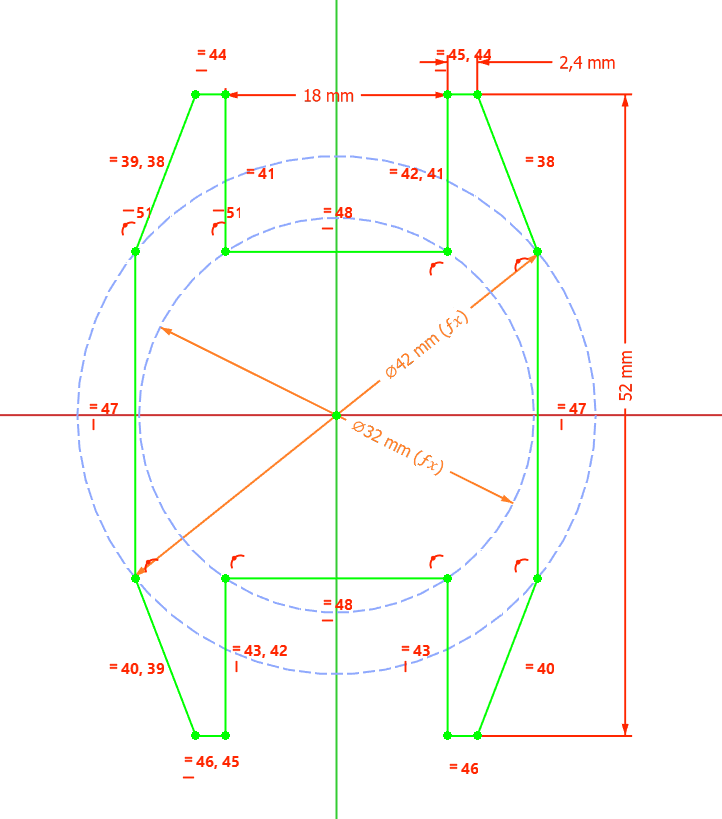
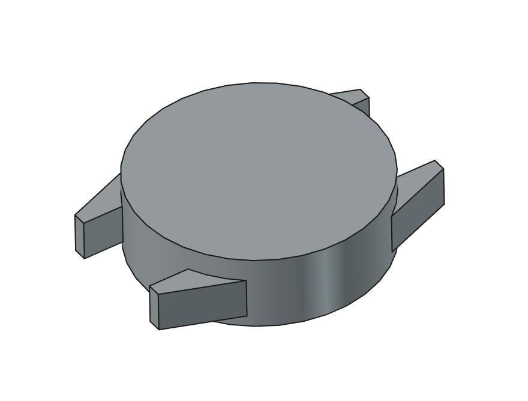
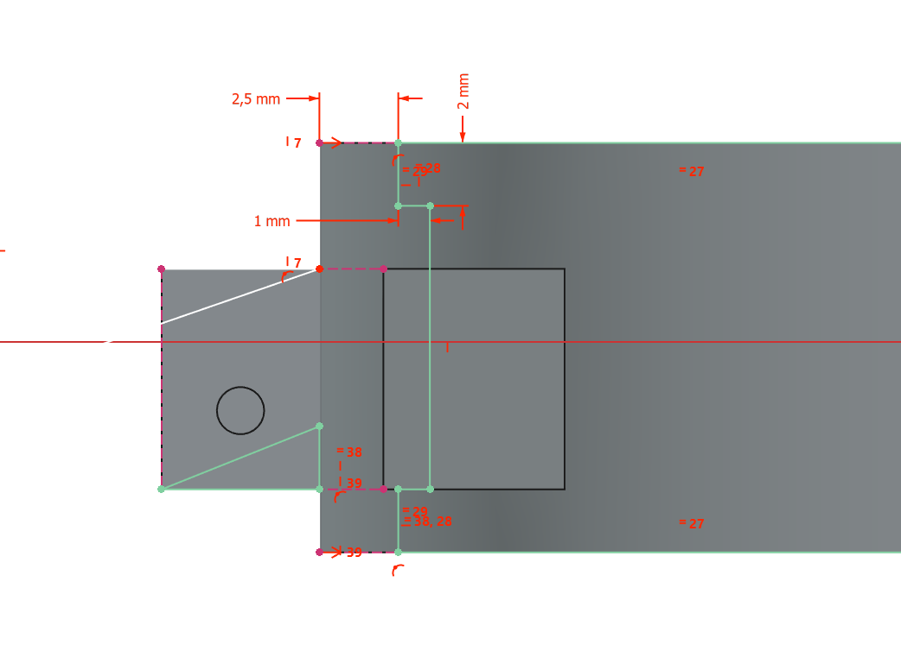
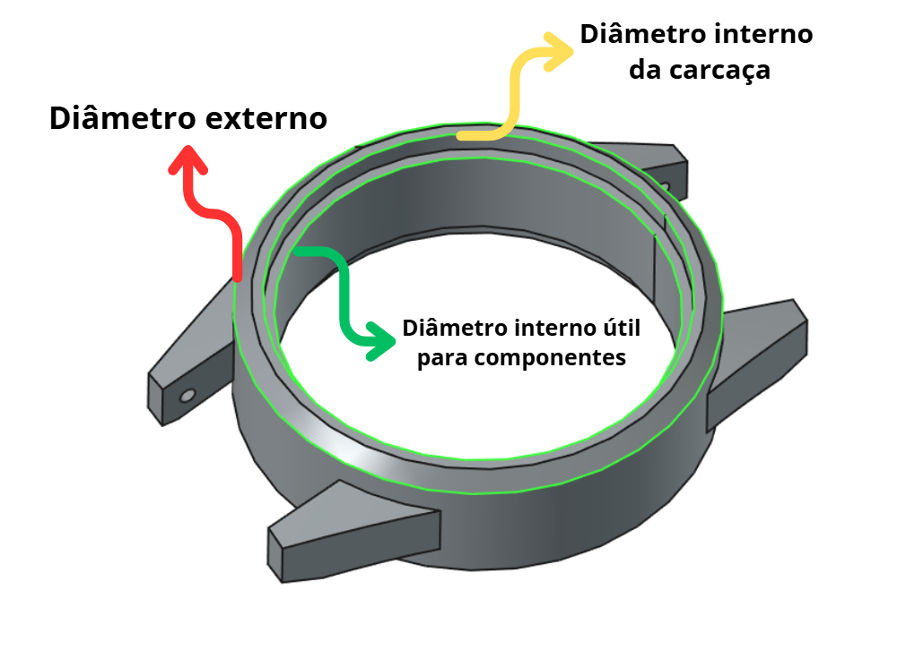
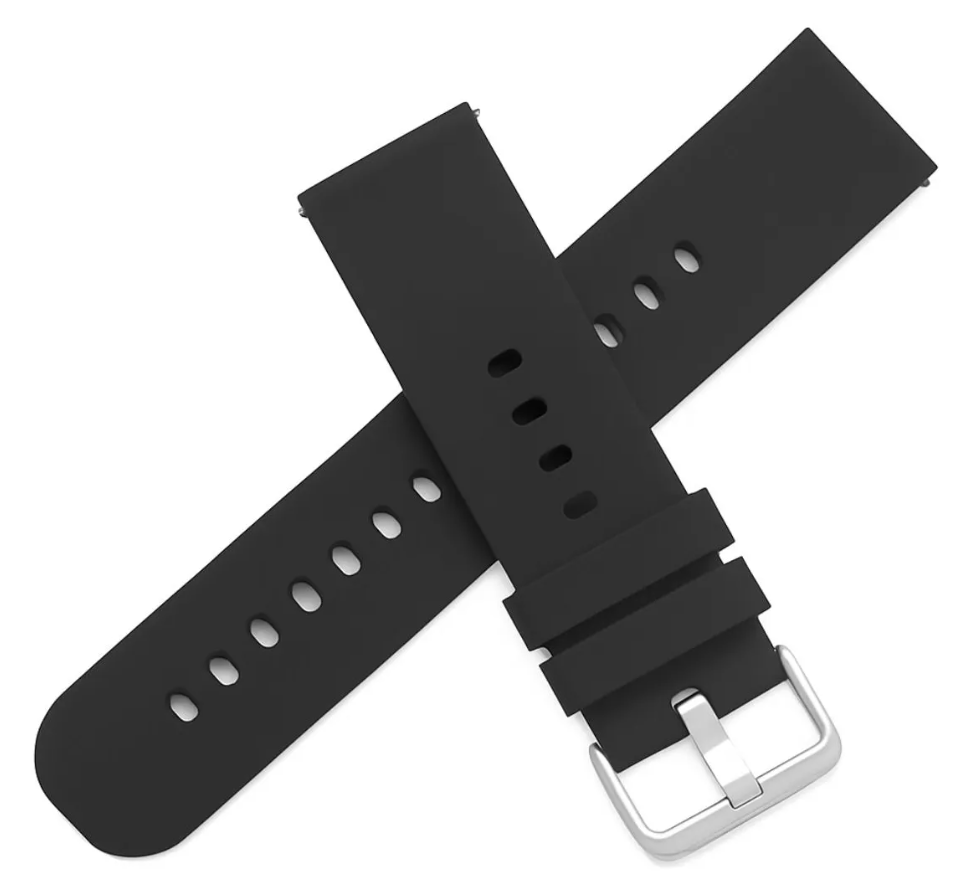
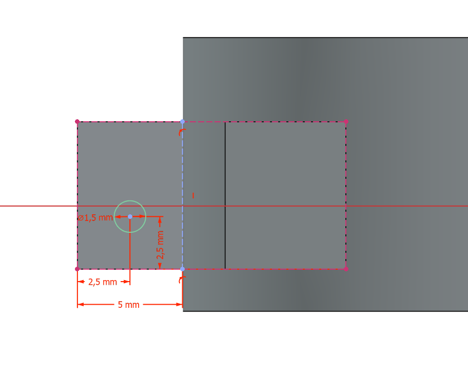

# Mecânica

Após os estudos realizados na Etapa 1, nos quais foram estabelecidas as restrições dimensionais, ergonômicas, de massa, seleção de materiais e mecanismos de fixação, iniciou-se na Etapa 2 o desenvolvimento do projeto mecânico da Pulseira SysCare.

Nesta etapa, os requisitos previamente definidos foram convertidos em dimensões e características geométricas para a construção do modelo mecânico, buscando conciliar a acomodação dos componentes eletrônicos com os requisitos de conforto, resistência mecânica, fabricação e utilização contínua do dispositivo.

## Definição das dimensões da Pulseira SysCare

Para o desenvolvimento do primeiro protótipo, foi definida uma geometria compacta para a carcaça, com 42 mm de largura e 52 mm de comprimento total, incluindo as garras destinadas à fixação da pulseira. A interface com a pulseira foi definida para uma largura de 18 mm, utilizando pinos de mola como mecanismo de fixação.

As dimensões externas adotadas para a estrutura inicial são apresentadas na Figura 1.

  
  
Figura 1 - Cotas definidas para a estrutura mecânica inicial da Pulseira SysCare.

A partir das dimensões estabelecidas, foi desenvolvido o primeiro modelo tridimensional da estrutura mecânica. O resultado da geometria inicial é apresentado na Figura 2.

  
  
Figura 2 - Modelo tridimensional da estrutura mecânica inicial da Pulseira SysCare.

### Definição do espaço interno

Após a definição das dimensões externas, foi realizado o detalhamento da região interna da carcaça. Essa etapa teve como objetivo estabelecer as dimensões das paredes e determinar o espaço disponível para a acomodação dos componentes eletrônicos.

Para isso, foi realizado um corte no modelo tridimensional, permitindo visualizar a geometria interna e definir as principais cotas relacionadas aos diâmetros da estrutura, conforme apresentado na Figura 3.

  
  
Figura 3 - Corte da estrutura para definição das dimensões internas da carcaça.

Com base na geometria analisada, foram definidos três diâmetros de referência para a estrutura: o diâmetro externo de 42 mm, o diâmetro interno da carcaça de 37 mm e o diâmetro interno útil de 35 mm, destinado à região de acomodação dos componentes eletrônicos.

A Figura 4 apresenta a localização das dimensões definidas para os diâmetros externo, interno e útil da carcaça.

  
  
Figura 4 - Dimensões dos diâmetros externo, interno e da região útil da carcaça da Pulseira SysCare.

O diâmetro interno de 37 mm corresponde ao espaço interno delimitado pela estrutura da carcaça, enquanto o diâmetro útil de 35 mm define a região de referência destinada à distribuição dos componentes eletrônicos. A diferença entre essas dimensões resulta em uma margem radial de aproximadamente 1 mm, utilizada como região de separação entre a área de acomodação dos componentes e a estrutura interna da carcaça.

A área circular correspondente à região útil de 35 mm de diâmetro é calculada por:

$$
  A = \pi r^2
$$

onde:

$$
  r = \frac{35}{2} = 17,5\text{ mm}
$$

Assim:

$$
  A = \pi(17,5)^2
$$

$$
  \boxed{A \approx 962,11\text{ mm}^2}
$$

Essa área é utilizada como referência para o desenvolvimento do *layout* interno e para a distribuição dos componentes, como a PCB, bateria, acelerômetro e antena BLE. A definição final do posicionamento desses componentes deverá considerar também suas dimensões individuais, altura, conexões elétricas e requisitos específicos de funcionamento.

### Mecanismos de fixação e Pulseira

Para a fixação da carcaça à pulseira, foi definida a utilização de uma pulseira comercial de silicone de 18 mm de largura, tendo como referência o modelo [Wawe](https://www.mercadolivre.com.br/pulseira-22mm-silicone-wawe-para-relogio-smartwatch-c-pinos-cor-preta/p/MLB27101261?pdp_filters=seller_id%3A554440847#polycard_client=recommendations_pdp-seller_items-above&reco_backend=ranker-retsys-same-seller&reco_model=fallback_same-seller&reco_client=pdp-seller_items-above&reco_item_pos=0&reco_backend_type=low_level&reco_id=53201d97-38cf-43e9-8262-48ce6e3023e8&wid=MLB3449594979&sid=recos)[1], selecionado por sua disponibilidade comercial, flexibilidade e utilização de pinos de engate para a fixação à carcaça. A utilização de um componente comercial também facilita a substituição da pulseira e a montagem do protótipo, esta pode ser vista na Figura 5.

 
   
  
Figura 5 - Pulseira Wawe 18mm de silicone
 

A fixação será realizada por meio de pinos de mola (*spring bars*), posicionados entre as garras da carcaça. Esse mecanismo foi selecionado devido à sua simplicidade construtiva, baixo volume, facilidade de montagem e ampla disponibilidade comercial.

Inicialmente, foi estabelecida uma distância de 2,5 mm entre a extremidade das garras e o centro do furo destinado ao pino de mola, conforme apresentado na Figura 6. Essa dimensão será utilizada como referência para o desenvolvimento inicial da geometria.

Entretanto, a posição definitiva do furo será definida após a validação dimensional da pulseira selecionada, uma vez que a distância entre a extremidade da pulseira e o eixo do pino pode variar de acordo com o modelo e o fabricante. Dessa forma, a geometria das garras será ajustada de acordo com as dimensões da pulseira efetivamente utilizada no protótipo, garantindo o correto alinhamento entre os furos da carcaça, a pulseira e o pino de mola.

 
   
  
Figura 6 - Dimensões iniciais da região de fixação da pulseira
 

### Síntese das dimensões mecânicas

A partir do processo de desenvolvimento realizado, foram estabelecidas as principais dimensões mecânicas da primeira versão da Pulseira SysCare. A Tabela 1 apresenta a síntese dos valores definidos.

| Parâmetro | Valor |
|---|---:|
| Largura externa da carcaça | **42 mm** |
| Comprimento total da carcaça | **52 mm** |
| Diâmetro interno da carcaça | **37 mm** |
| Diâmetro interno útil | **35 mm** |
| Largura da pulseira | **18 mm** |
| Área interna útil de referência | **962,11 mm²** |
| Sistema de fixação | **Pino de mola** |

  
Tabela 1 - Dimensões mecânicas definidas

Essas dimensões constituem a referência para as próximas etapas do desenvolvimento mecânico ainda nesta fase, nas quais será realizada a integração dos componentes eletrônicos, o detalhamento da carcaça, a definição das espessuras estruturais e a preparação do modelo para fabricação por impressão 3D.

##  Definição do Material da Pulseira SysCare

A partir dos estudos realizados na Etapa 1, foi definida a utilização de manufatura aditiva por impressão 3D para a fabricação da carcaça da Pulseira SysCare. Dessa forma, a seleção do material na Etapa 2 considera as propriedades mecânicas necessárias ao protótipo, a disponibilidade do processo de fabricação no IFSC e os requisitos relacionados ao contato prolongado com a pele.

Para o protótipo, será utilizado o filamento disponível no IFSC, selecionado de acordo com suas características mecânicas e sua adequação ao processo de impressão empregado. A utilização de um material já disponível para fabricação permite reduzir custos e simplificar a produção das primeiras versões da carcaça, possibilitando que alterações dimensionais e geométricas sejam realizadas durante o processo de desenvolvimento.

A escolha do material também considera as características geométricas definidas para a carcaça, que possui dimensões reduzidas e apresenta regiões destinadas à fixação da pulseira. Dessa forma, o material deve apresentar resistência mecânica suficiente para suportar o manuseio, a montagem dos componentes e os esforços associados à utilização cotidiana do dispositivo, sem comprometer a fabricação das características de pequena dimensão.

Embora o material selecionado seja adequado para a fabricação do protótipo, sua utilização não constitui, por si só, comprovação de biocompatibilidade para contato prolongado com a pele. Conforme discutido na Etapa 1, a composição do filamento comercial pode incluir corantes e outros aditivos, cujas características devem ser consideradas na avaliação do material. 
Portanto uma versão destinada à utilização prolongada, deverão ser avaliadas as informações fornecidas pelo fabricante.

Além da seleção do filamento, parâmetros de fabricação como temperatura de impressão, preenchimento e orientação das peças poderão influenciar as propriedades mecânicas e o acabamento superficial da carcaça. Esses parâmetros serão definidos e ajustados durante a fabricação do protótipo, buscando obter uma peça com resistência adequada, boa qualidade superficial e dimensões compatíveis com o projeto.

Assim, o material disponível no IFSC foi definido como referência para a fabricação do primeiro protótipo, mantendo-se a possibilidade de substituição por outro filamento caso os ensaios mecânicos, a qualidade de fabricação ou os requisitos de contato com a pele indiquem a necessidade de uma alternativa.

## Definição da Massa da Pulseira SysCare

Após a definição dos principais componentes eletrônicos e das dimensões da estrutura mecânica, é possível realizar uma estimativa preliminar da massa total da Pulseira SysCare. Essa estimativa considera a massa dos componentes eletrônicos, da bateria, da placa de circuito impresso (PCI) e da estrutura mecânica produzida por impressão 3D.

A massa total do dispositivo pode ser obtida pela soma das massas individuais dos principais elementos que compõem a pulseira, conforme apresentado na Tabela 2. Essa estimativa permite avaliar se a solução proposta apresenta características adequadas para utilização no pulso, além de auxiliar no dimensionamento e na avaliação da estrutura mecânica.

| Componente                           | Massa estimada (g) |
| ------------------------------------ | -----------------: |
| Estrutura da pulseira impressa em 3D |                  X |
| Bateria                              |                  X |
| Acelerômetro IIM-42351               |                  X |
| Microcontrolador XIAO nRF52840       |                4,7 |
| PCI                                  |                  X |
| **Massa total estimada**             |              **X** |

  
Tabela 2 - Estimativa da massa total

Essa análise será utilizada como uma estimativa inicial, uma vez que a massa final poderá sofrer alterações após a fabricação da estrutura mecânica e da PCI, principalmente em função da quantidade de material utilizada na impressão 3D e das dimensões finais da placa.

## Referências (links/datasheets/livros)

- [1] [Pulseira 22mm Silicone Wawe Para Relogio Smartwatch C/ Pinos Cor Preta - Mercado Livre](https://www.mercadolivre.com.br/pulseira-22mm-silicone-wawe-para-relogio-smartwatch-c-pinos-cor-preta/p/MLB27101261?pdp_filters=seller_id%3A554440847#polycard_client=recommendations_pdp-seller_items-above&reco_backend=ranker-retsys-same-seller&reco_model=fallback_same-seller&reco_client=pdp-seller_items-above&reco_item_pos=0&reco_backend_type=low_level&reco_id=53201d97-38cf-43e9-8262-48ce6e3023e8&wid=MLB3449594979&sid=recos)