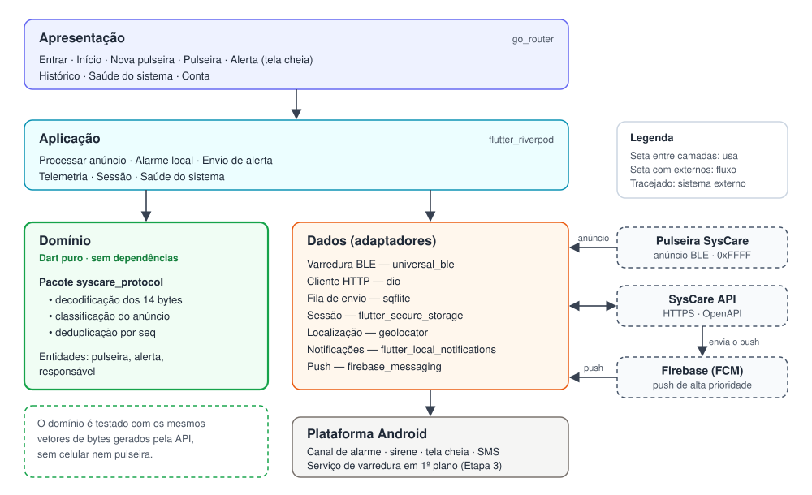
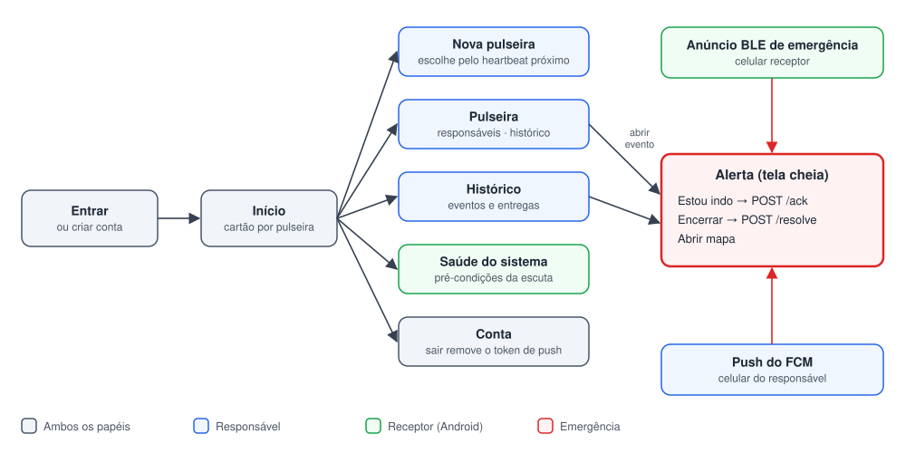
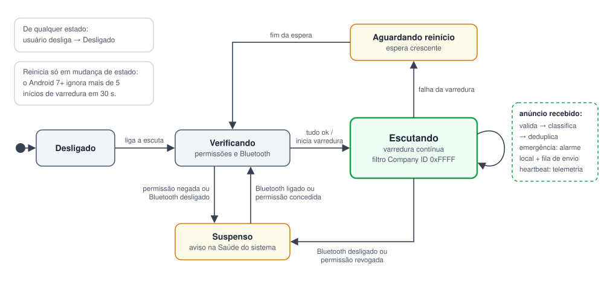
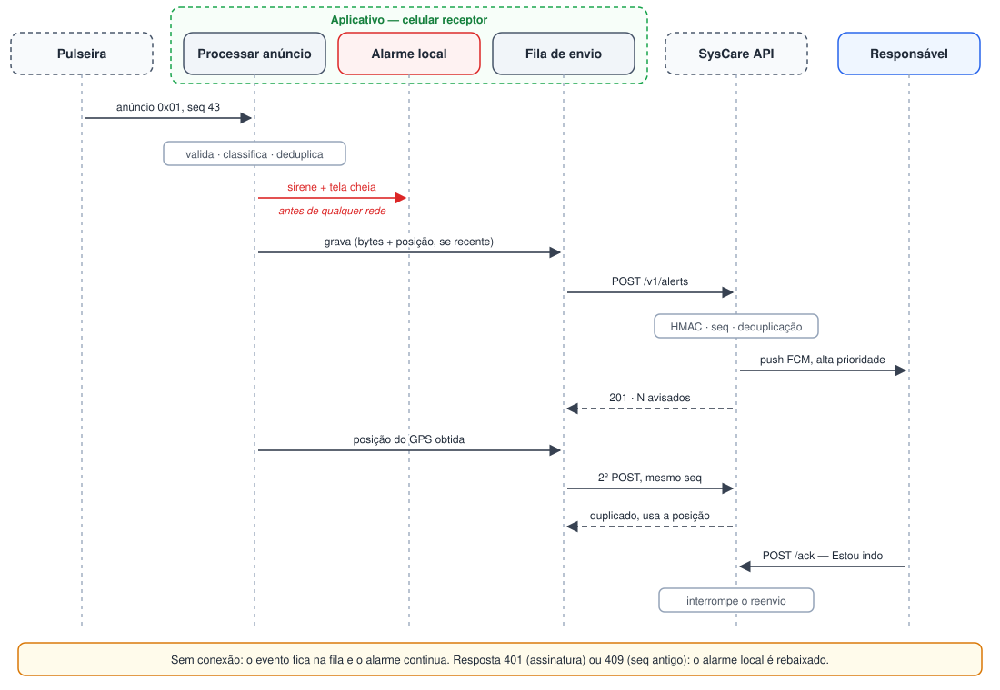

# Aplicativo - Arquitetura (UI, comunicação BLE e API)

Este documento define a arquitetura do aplicativo móvel do SysCare. A [Etapa 1](../../../etapa_1/software/README.md) estabeleceu **o que** o aplicativo faz — escutar o anúncio da pulseira, alarmar localmente antes de qualquer acesso à rede, repassar o evento ao servidor e oferecer a interface de gestão dos responsáveis — e deixou para esta etapa a escolha da plataforma e da forma de implementação. Aqui se define **como** o aplicativo é construído: plataforma, divisão em camadas, telas, tratamento do anúncio BLE e integração com a API.

O aplicativo não é projetado no vácuo: ele se encaixa entre dois contratos já fixados. De um lado, o [protocolo BLE](../api/docs/ble_payload.md), que define os 14 bytes anunciados pela pulseira; do outro, a [API](../api/README.md), cujas rotas e formatos são publicados automaticamente em OpenAPI. Toda decisão deste documento respeita esses dois contratos, e as divergências encontradas entre eles foram registradas na Seção 9.

## 1. Plataforma e papéis do aplicativo

O aplicativo atende a dois papéis com exigências muito diferentes, ambos já previstos no diagrama de casos de uso da Etapa 1:

| Papel | Onde está o celular | O que faz | Depende de BLE? | Depende de Internet? |
|---|---|---|:---:|:---:|
| **Receptor** | Perto da pessoa monitorada (o próprio celular dela ou de um familiar na mesma casa) | Escuta a pulseira, alarma localmente, obtém a localização e repassa o evento à API | Sim | Não para alarmar; sim para repassar |
| **Responsável** | Em qualquer lugar | Recebe o *push*, confirma o atendimento, encerra o evento e gerencia pulseiras e responsáveis | Não | Sim |

A distinção é determinante para a escolha da plataforma. O papel de receptor depende de varredura BLE contínua, e o iOS impõe restrições que o tornam inviável nesse sistema operacional (Seção 4.6). O papel de responsável, por outro lado, usa apenas a API e o *push*, e precisa funcionar também no iPhone de um familiar.

| Critério | Flutter | Kotlin nativo | React Native |
|---|---|---|---|
| Uma base de código para Android e iOS | Sim | Não (apenas Android) | Sim |
| Linguagem | Dart | Kotlin | JavaScript/TypeScript |
| Acesso a recursos exclusivos do Android (canal de alarme, serviço em primeiro plano) | Por *platform channels* | Direto | Por módulos nativos |
| Regras de negócio testáveis sem aparelho | Sim, em Dart puro | Sim, na JVM | Sim, em Node |

Foi adotado o **Flutter**. O Kotlin nativo excluiria os responsáveis com iPhone, e a parte que exige código nativo do Android — canal de alarme e, na Etapa 3, o serviço de varredura em segundo plano — é pequena e fica isolada em uma única camada. Entre as duas opções multiplataforma, o Flutter permite concentrar o protocolo em um pacote Dart puro, testado byte a byte contra a implementação de referência da API (Seção 2). O aplicativo é, portanto, **multiplataforma para o papel de responsável e exclusivo do Android para o papel de receptor**.

## 2. Arquitetura em camadas

  
  
Figura 1 - Camadas do aplicativo e sistemas externos

O aplicativo é dividido em cinco camadas. A apresentação usa a aplicação; a aplicação usa o domínio e os adaptadores da camada de dados; os adaptadores usam a plataforma Android e os sistemas externos. O **domínio não depende de nenhuma outra camada nem de biblioteca externa**, nem mesmo do Flutter.

| Camada | Responsabilidade | Componentes principais |
|---|---|---|
| **Apresentação** | Telas, navegação e exibição de estado | As oito telas da Seção 3; rotas com `go_router` |
| **Aplicação** | Orquestra os casos de uso e mantém o estado da interface | Processar anúncio, alarme local, envio de alerta, agregação de telemetria, sessão, saúde do sistema; estado com `flutter_riverpod` |
| **Domínio** | Regras do SysCare, independentes de plataforma | Pacote `syscare_protocol`: decodificação dos 14 bytes, classificação do anúncio, deduplicação por `seq`, entidades pulseira, alerta e responsável |
| **Dados** | Adaptadores para o mundo externo | Cliente HTTP (`dio`), varredura BLE (`universal_ble`), fila de envio (`sqflite`), cofre de sessão (`flutter_secure_storage`), localização (`geolocator`), notificações (`flutter_local_notifications`), *push* (`firebase_messaging`) |
| **Plataforma Android** | O que só existe no Android | Canal de notificação de alarme, som de sirene, tela cheia; na Etapa 3, o serviço de varredura em primeiro plano |

O isolamento do domínio tem uma consequência prática: o pacote `syscare_protocol` é testado com os **mesmos vetores de bytes gerados pelo código Python da API**. Se o aplicativo e o servidor lerem o pacote de forma diferente, o teste falha antes de qualquer pulseira existir — e, depois, o mesmo teste confere o firmware.

## 3. Interface (UI)

  
  
Figura 2 - Mapa de telas e navegação

| Tela | Papel | O que mostra | Ações |
|---|---|---|---|
| **Entrar / Criar conta** | Ambos | Formulário de acesso | Autenticar; criar conta |
| **Início** | Ambos | Um cartão por pulseira: pessoa monitorada, bateria, "vista há X min" e se este celular está escutando | Abrir pulseira; ligar ou desligar a escuta neste celular |
| **Nova pulseira** | Responsável | Pulseiras SysCare próximas, detectadas pelo *heartbeat*, para escolher em vez de digitar o identificador | Cadastrar; exibir a chave do firmware **uma única vez** |
| **Pulseira** | Responsável | Dados da pulseira; aba de responsáveis por prioridade; aba de histórico | Editar; incluir, ativar, desativar e remover responsáveis — ações exibidas só ao dono, identificado pelo campo `owner_id` |
| **Alerta** (tela cheia) | Ambos | Tipo do evento, pessoa, horário, impacto, localização e quem já foi avisado | **Estou indo**; **Encerrar** como atendido ou falso alarme; abrir o mapa |
| **Histórico** | Responsável | Eventos de todas as pulseiras, com a situação de cada um; o histórico de uma só pulseira fica na tela dela | Abrir o evento, com as entregas de cada notificação |
| **Saúde do sistema** | Receptor | Lista de verificação: Bluetooth, permissões, notificações, tela cheia, servidor, sessão, último *heartbeat* de cada pulseira, itens na fila de envio | Corrigir cada item; tocar o alarme de teste |
| **Conta** | Ambos | Dados do usuário e o código de responsável (pendência P6) | Copiar o código; sair |

A tela **Saúde do sistema** existe porque, em um sistema de emergência, a falha silenciosa é o pior modo de falha: uma permissão revogada ou o Bluetooth desligado não geram erro visível, apenas deixam de alarmar. A tela transforma cada pré-condição em um item verificável, e a tela Início mostra um atalho para ela sempre que a escuta estiver suspensa.

Os critérios de interface consideram que o receptor muitas vezes está no celular de uma pessoa idosa:

- **Área de toque mínima de 48 dp × 48 dp** e contraste mínimo de 4,5:1 para textos pequenos, conforme a recomendação de acessibilidade do Android [1]; na tela de alerta, os dois botões ocupam a largura da tela.
- **Tamanho de fonte do sistema respeitado** em todas as telas, sem textos em tamanho fixo.
- **Estado nunca comunicado só por cor**: cada situação combina cor, ícone e texto ("Bateria baixa", e não apenas um ícone vermelho).
- **Uma ação principal por tela**, com linguagem direta e sem termos técnicos ("Estou indo", e não "Confirmar recebimento").

## 4. Comunicação BLE

### 4.1 Escolha do pacote

| Pacote | Licença | Filtro por *manufacturer data* | Observação |
|---|---|:---:|---|
| **`universal_ble`** | BSD-3 [2] | Sim, por Company ID [2] | **Adotado** |
| `flutter_blue_plus` | Própria: gratuita para instituições de ensino, **licença comercial paga** para empresas [3] | Sim [3] | A licença inviabiliza a evolução do protótipo para produto |
| `flutter_reactive_ble` | BSD-3 [4] | Não documentado; filtra só por serviço [4] | Exigiria filtrar em software, sem o filtro no rádio |

O filtro por Company ID é requisito, e não conveniência: sem filtro, o Android pausa a varredura com a tela apagada (Seção 4.3).

### 4.2 Do anúncio à decisão

Cada anúncio recebido passa por quatro etapas, todas no domínio:

1. **Filtro no rádio.** A varredura é iniciada com filtro pelo Company ID `0xFFFF`. Como esse identificador é reservado para testes e usado por outros dispositivos em desenvolvimento, o filtro reduz o volume, mas não garante que o anúncio seja do SysCare.
2. **Validação.** O pacote precisa ter exatamente 14 bytes, versão `0x01` e código de evento conhecido; qualquer outro é descartado.
3. **Classificação.** O código do evento define a reação:

| Código | Evento | Reação no receptor |
|---|---|---|
| `0x01` `0x02` `0x03` | Queda, botão de pânico, imobilidade | **Alarme de emergência** (sirene e tela cheia) e envio à API |
| `0x04` | Bateria baixa | Notificação comum, sem sirene, e envio à API |
| `0x00` | Teste | Notificação discreta de "teste recebido" e envio à API |
| `0x05` | *Heartbeat* | Atualiza "vista há X min" e alimenta a telemetria (Seção 5.5); **nunca alarma** |

4. **Deduplicação.** A pulseira repete o anúncio de emergência a cada 100 ms por 30 s e a cada 500 ms pelos 5 min seguintes. O receptor guarda, em armazenamento persistente, o último `seq` tratado de cada pulseira, e só trata um evento com `seq` mais novo, usando aritmética circular de 16 bits. Assim, nem a repetição do anúncio nem a reabertura do aplicativo tocam a sirene duas vezes pelo mesmo evento.

O código `0x05` é uma **revisão do protocolo feita nesta etapa**. A versão anterior previa o *heartbeat*, mas sem código próprio: um aplicativo recém-aberto que ouvisse o *heartbeat* repetindo o último evento tocaria a sirene por uma queda antiga. A revisão, com a justificativa completa, está no [contrato BLE](../api/docs/ble_payload.md), e a API já foi ajustada para recusar `0x05` como alerta e deduplicar a telemetria por janela de tempo.

Pulseiras que não pertencem à conta do receptor não tocam a sirene, mas seus eventos de emergência são repassados à API. Isso preserva a propriedade do *broadcast* definida na Etapa 1 — qualquer celular próximo ajuda — sem alarmar um desconhecido: a API só notifica os responsáveis daquela pulseira.

### 4.3 Máquina de estados da varredura

  
  
Figura 3 - Máquina de estados do componente de varredura BLE

A varredura é tratada como uma máquina de estados, e não como uma chamada isolada, por causa de duas restrições do Android que falham **sem gerar erro**:

- A partir do Android 7, um aplicativo que inicia a varredura mais de cinco vezes em 30 s deixa de receber resultados até o fim da janela [5]. Por isso a varredura é mantida ligada continuamente e só é reiniciada em mudanças de estado (Bluetooth ligado ou desligado, permissão concedida), com espera crescente entre tentativas.
- A partir do Android 8.1, varreduras sem filtro são pausadas enquanto a tela está apagada [6]. O filtro por Company ID da Seção 4.2 evita essa pausa.

Qualquer saída do estado **Escutando** por causa externa leva ao estado **Suspenso**, que acende o aviso da tela Saúde do sistema.

### 4.4 Permissões

| Versão do Android | Permissões | Motivo |
|---|---|---|
| Até 11 (API 30) | `BLUETOOTH`, `BLUETOOTH_ADMIN`, `ACCESS_FINE_LOCATION` | Nessas versões a varredura BLE exige localização [7] |
| 10 e 11 | `ACCESS_BACKGROUND_LOCATION` | Descoberta de dispositivos a partir de um serviço [7] (Etapa 3) |
| 12 ou superior (API 31+) | `BLUETOOTH_SCAN`, **sem** a opção `neverForLocation` | A opção faz o sistema filtrar alguns *beacons* dos resultados [7], e o anúncio do SysCare tem formato de *beacon* |
| 12 ou superior (API 31+) | `BLUETOOTH_CONNECT` | Exigida pelo pacote `universal_ble` mesmo quando o aplicativo só varre; na Etapa 3, é a permissão da conexão de confirmação com a pulseira |
| Todas | `ACCESS_FINE_LOCATION` | Localização do evento, independentemente da varredura |
| 13 ou superior | `POST_NOTIFICATIONS` | Sem ela, todos os canais de notificação ficam bloqueados [8] |
| 14 ou superior | `USE_FULL_SCREEN_INTENT` | Restrita a aplicativos de chamada e de alarme; o aplicativo verifica se foi concedida antes de usar [9] |

As permissões são solicitadas no primeiro uso da escuta, com uma explicação antes de cada pedido, e não todas na abertura do aplicativo.

### 4.5 Primeiro e segundo plano

Nesta etapa, a varredura funciona **com o aplicativo em primeiro plano**, o que basta para validar o protocolo, o alarme e a integração com a API. A varredura com a tela apagada e o aplicativo fechado, exigida pela Etapa 1, fica especificada aqui e é implementada na Etapa 3:

- **Serviço em primeiro plano** do tipo `connectedDevice`, cuja pré-condição é satisfeita pela própria permissão `BLUETOOTH_SCAN` [10]. Ele foi preferido à varredura entregue por *PendingIntent* porque o evento precisa disparar trabalho imediato — alarme, localização e envio — e o serviço mantém o processo ativo para isso.
- **Reinício automático** após o celular ser ligado (`RECEIVE_BOOT_COMPLETED`).
- **Isenção da otimização de bateria**, pedida pela tela Saúde do sistema, e testes em aparelhos de fabricantes que encerram serviços em segundo plano de forma agressiva.

### 4.6 Por que o receptor não roda no iOS

Três restrições documentadas do iOS inviabilizam o papel de receptor:

1. Em segundo plano, o aplicativo **precisa informar os identificadores de serviço** que procura [11]. O anúncio do SysCare usa *manufacturer data* e não anuncia serviço; um identificador de 128 bits próprio não cabe junto do pacote nos 31 bytes do anúncio, e os de 16 bits são atribuídos pela Bluetooth SIG.
2. Em segundo plano, **descobertas repetidas do mesmo periférico são agrupadas em um único evento** [12]. Como a pulseira anuncia o *heartbeat* a cada 2 s, a mudança para o anúncio de emergência pode não gerar uma nova descoberta.
3. Em segundo plano, **o intervalo de varredura aumenta**, e a descoberta pode demorar mais [12].

O iPhone continua atendendo integralmente o papel de responsável.

### 4.7 Alarme antes da verificação

O receptor dispara a sirene **antes** de a API verificar a assinatura HMAC, porque a Etapa 1 definiu que o alarme local não depende da rede. A consequência é que um anúncio forjado por alguém ao alcance do rádio toca a sirene. Em um sistema de emergência, deixar de alarmar uma queda real é mais grave que um alarme indevido, então o alarme é mantido. Porém, quando a API responde que a assinatura é inválida ou que o `seq` é antigo, o aplicativo **rebaixa o alarme**: interrompe a sirene e informa que o anúncio foi rejeitado. Sem conexão, o alarme segue ativo. A verificação no próprio celular, que exigiria guardar a chave no aparelho do dono, fica avaliada para a Etapa 3.

## 5. Comunicação com a API

### 5.1 Contrato

A API publica sua especificação OpenAPI automaticamente [13]. Uma [cópia dessa especificação](./contratos/openapi.json) é versionada junto do aplicativo, e os modelos de dados em Dart são escritos a partir dela; qualquer mudança na API aparece como diferença nesse arquivo antes de chegar ao aplicativo.

### 5.2 Rotas por funcionalidade

| Funcionalidade | Rotas |
|---|---|
| Conta e sessão | `POST /v1/auth/register`, `POST /v1/auth/login`, `GET /v1/auth/me` |
| *Push* | `POST /v1/auth/push-tokens` (após o login e a cada renovação do *token*), `DELETE /v1/auth/push-tokens/{token_id}` (ao sair) |
| Pulseiras | `GET/POST /v1/devices`, `GET/PATCH /v1/devices/{device_id}` |
| Responsáveis | `GET/POST /v1/devices/{device_id}/caregivers`, `PATCH/DELETE /v1/devices/{device_id}/caregivers/{caregiver_id}` |
| Evento ouvido pelo receptor | `POST /v1/alerts`, com os 14 bytes em `raw_payload` |
| Histórico e alerta | `GET /v1/alerts`, `GET /v1/alerts/{alert_id}` |
| Atendimento | `POST /v1/alerts/{alert_id}/ack`, `POST /v1/alerts/{alert_id}/resolve` |
| Presença e bateria | `POST /v1/telemetry` |
| Saúde do sistema | `GET /health` |

O receptor envia sempre os bytes originais em `raw_payload`, e não campos decodificados: é sobre esses bytes que a pulseira calculou a assinatura, e o celular não deve reinterpretá-los.

### 5.3 Sessão

O *token* JWT recebido no login é guardado com `flutter_secure_storage`, que usa o armazenamento de chaves do sistema, e é anexado a cada requisição por um interceptador do cliente HTTP. Uma resposta de sessão inválida leva o usuário à tela de entrada sem descartar a fila de envio e **sem interromper a escuta nem o alarme local**, que não dependem da rede: apenas o repasse aos responsáveis fica aguardando o novo login.

### 5.4 Fila de envio e localização

Todo evento é **gravado na fila local antes de ser enviado**, e só sai dela quando a API responde de forma definitiva. Uma falha de rede, portanto, nunca descarta um evento: ele é reenviado com espera crescente e também quando o aplicativo volta a abrir.

A localização é obtida em dois tempos, aproveitando uma regra que a API já implementa. Se o celular tem uma posição conhecida recente, ela segue no primeiro envio; se não tem, o evento é enviado **sem esperar o GPS**, e um segundo envio com os mesmos bytes e a posição obtida é feito em seguida. A API trata o segundo envio como duplicado dentro da janela de 180 s e **aproveita a localização** que faltava no primeiro. O alerta chega aos responsáveis sem esperar o GPS, e a posição chega logo depois.

| Resposta da API | Significado | Ação do aplicativo |
|---|---|---|
| `201`, não duplicado | Alerta criado e responsáveis notificados | Mostra quantos responsáveis foram avisados |
| `201`, duplicado | Outro celular já havia reportado | Mostra "já reportado"; mantém o alarme local |
| `401` por assinatura | Anúncio forjado | Rebaixa o alarme (Seção 4.7) e descarta |
| `401` por sessão | *Token* expirado ou inválido | Mantém na fila e pede novo login |
| `404` | Pulseira não cadastrada | Descarta |
| `409` | `seq` antigo (retransmissão) | Rebaixa o alarme e descarta |
| `422` | Pacote inválido ou horário fora da janela aceita | Descarta e registra |
| Sem conexão ou `5xx` | Servidor inacessível | Mantém na fila; o alarme local continua |

### 5.5 Telemetria

O *heartbeat* chega a cada 2 s. O aplicativo guarda **uma amostra por pulseira a cada 60 s**, que é a mesma janela de deduplicação da API, e envia o lote a cada poucos minutos. Assim, vários celulares ouvindo a mesma pulseira geram uma única amostra por minuto no servidor.

### 5.6 *Push*

O aplicativo cria o canal de notificação `syscare_emergencia` e inclui o som `sirene`, que são os identificadores que a API já envia no *push* de alta prioridade. O som usa o fluxo de áudio de alarme do Android, o mesmo do despertador, que continua ativo com o celular no modo silencioso. O campo `alert_id` do *push* abre diretamente a tela de Alerta. Se o *push* chega para um alerta que este mesmo celular já está exibindo por ter ouvido o anúncio, ele não alarma pela segunda vez.

## 6. Fluxo do alerta no aplicativo

  
  
Figura 4 - Sequência do alerta, do anúncio à confirmação

A ordem da Figura 4 é a principal decisão desta arquitetura: **o alarme local vem antes de tudo**. Ele depende apenas do rádio e do próprio celular, e é disparado assim que o anúncio é classificado como emergência. Localização, fila e API vêm depois, e nenhuma falha nessas etapas cancela o alarme — só uma rejeição explícita do servidor o rebaixa.

## 7. Rastreabilidade com a Etapa 1

| Requisito do aplicativo definido na Etapa 1 | Onde é atendido | Etapa |
|---|---|:---:|
| Varredura contínua em segundo plano | Componente de varredura; serviço em primeiro plano | 2 (primeiro plano) e 3 |
| Alarme local antes de qualquer chamada de rede | Processar anúncio → alarme local (Figura 4) | 2 |
| Localização do ocorrido | Localização em dois tempos (Seção 5.4) | 2 |
| Envio com fila de reenvio | Fila de envio persistente | 2 |
| Criação da conta e cadastro da pulseira | Telas Entrar e Nova pulseira | 2 |
| Cadastro dos responsáveis com prioridade | Tela Pulseira, aba Responsáveis | 2 |
| Histórico e estado da pulseira | Telas Início e Histórico; telemetria | 2 |
| Confirmação "estou indo" | Tela Alerta | 2 |
| Encerramento como atendido ou falso positivo | Tela Alerta | 2 |

## 8. Escopo desta etapa

| Item | Etapa 2 (protótipo) | Etapa 3 |
|---|---|---|
| Escuta BLE | Aplicativo em primeiro plano | Serviço em primeiro plano, tela apagada, reinício no *boot* |
| Protocolo | Decodificação, classificação e deduplicação, testadas com vetores da API | Verificação da assinatura no celular (avaliar) |
| Alarme local | Canal de alarme e tela cheia | Testes em aparelhos de vários fabricantes |
| API | Sessão, pulseiras, responsáveis, envio com fila, histórico, confirmação e encerramento | Renovação de sessão; pendências da Seção 9 |
| *Push* | Canal e som do alarme já idênticos aos do *push*; recepção pendente da criação do projeto Firebase | Recepção do *push*; projeto Firebase definitivo; iOS |
| Chave do firmware | Exibida uma vez no cadastro e gravada manualmente | Provisionamento por conexão BLE |

## 9. Pendências encontradas na API

A análise do aplicativo contra a API revelou divergências que afetam os fluxos acima:

| # | Pendência | Efeito no aplicativo | Situação |
|---|---|---|---|
| P1 | Confirmar, encerrar e consultar um alerta, e listar pulseiras, eram permitidos só ao **dono** da pulseira, não aos demais responsáveis | Um responsável recebia o *push*, mas não conseguia tocar em "Estou indo", e o reenvio continuava para todos | **Corrigida**: o dono e os responsáveis ativos veem a pulseira e atendem alertas; editar a pulseira e a lista de responsáveis continua só com o dono |
| P2 | O *token* de sessão vale 7 dias e não há renovação | Um celular receptor deixado sem uso para de repassar eventos após uma semana | Aberta |
| P3 | Eventos com horário mais de 15 min diferente do servidor são recusados | Um evento que passou mais de 15 min na fila por falta de conexão é descartado | Aberta |
| P4 | Assinatura inválida e sessão inválida respondem com o mesmo código `401` | O aplicativo precisa diferenciar os dois casos pela presença do cabeçalho `WWW-Authenticate`, que só a sessão inválida envia | Aberta |
| P5 | A telemetria não carrega a assinatura da pulseira | Um *heartbeat* forjado pode esconder uma pulseira parada | Aberta |
| P6 | Vincular um responsável à conta dele no aplicativo exige o identificador interno dessa conta, e a API não oferece como encontrá-lo | O dono não consegue incluir um responsável com *push* sem que ele informe esse identificador | Contornada: a tela Conta exibe o "código de responsável" para ser repassado ao dono; a solução definitiva é um convite por e-mail |

## 10. Implementação do protótipo

O protótipo desta etapa segue a divisão da Seção 2, com cada camada em uma pasta própria do projeto Flutter:

| Camada | Pasta | Conteúdo |
|---|---|---|
| Apresentação | `lib/apresentacao` | As oito telas, rotas e tema |
| Aplicação | `lib/aplicacao` | Receptor (máquina de estados da Figura 3), envio da fila, telemetria, sessão e saúde do sistema |
| Domínio | `packages/syscare_protocol` e `lib/dominio` | Protocolo BLE em Dart puro e entidades da API |
| Dados | `lib/dados` | Cliente HTTP, varredura BLE, fila em SQLite, cofre da sessão, localização e alarme |
| Plataforma Android | `android/app/src/main` | Permissões da Seção 4.4, tela de alerta sobre a tela de bloqueio e o som da sirene, sintetizado para o projeto |

A validação é feita em três níveis de testes automatizados, todos sem celular nem pulseira: o pacote de protocolo lê os mesmos vetores de bytes gerados pela API; os modelos do aplicativo leem respostas reais capturadas da API; e o envio da fila é testado contra cada linha da tabela de respostas da Seção 5.4. O endereço da API é definido no momento da execução, o que permite apontar o aplicativo para o computador que roda o servidor na rede local durante os testes de campo. Sem a pulseira, o anúncio é simulado por um segundo celular com um aplicativo de anúncio BLE, usando os bytes gerados pela própria API.

## Referências (links/datasheets/livros)

- [1] [ANDROID DEVELOPERS. Make apps more accessible](https://developer.android.com/guide/topics/ui/accessibility/apps)

- [2] [NAVIDECK. universal_ble — pub.dev](https://pub.dev/packages/universal_ble)

- [3] [FLUTTER BLUE PLUS. flutter_blue_plus — pub.dev](https://pub.dev/packages/flutter_blue_plus)

- [4] [PHILIPS HUE. flutter_reactive_ble — pub.dev](https://pub.dev/packages/flutter_reactive_ble)

- [5] [PUNCH THROUGH. Troubleshooting Android BLE Scan Errors](https://punchthrough.com/android-ble-scan-errors/)

- [6] [VAN WELIE, M. Making Android BLE work — part 1](https://medium.com/@martijn.van.welie/making-android-ble-work-part-1-a736dcd53b02)

- [7] [ANDROID DEVELOPERS. Bluetooth permissions](https://developer.android.com/develop/connectivity/bluetooth/bt-permissions)

- [8] [ANDROID DEVELOPERS. Notification runtime permission](https://developer.android.com/develop/ui/views/notifications/notification-permission)

- [9] [ANDROID DEVELOPERS. Behavior changes: apps targeting Android 14 or higher](https://developer.android.com/about/versions/14/behavior-changes-14)

- [10] [ANDROID DEVELOPERS. Foreground service types](https://developer.android.com/develop/background-work/services/fgs/service-types)

- [11] [APPLE. scanForPeripherals(withServices:options:)](https://developer.apple.com/documentation/corebluetooth/cbcentralmanager/scanforperipherals(withservices:options:))

- [12] [APPLE. Core Bluetooth Background Processing for iOS Apps](https://developer.apple.com/library/archive/documentation/NetworkingInternetWeb/Conceptual/CoreBluetooth_concepts/CoreBluetoothBackgroundProcessingForIOSApps/PerformingTasksWhileYourAppIsInTheBackground.html)

- [13] [FASTAPI. First Steps — OpenAPI](https://fastapi.tiangolo.com/tutorial/first-steps/)

[⬅️ Etapa 2](../../README.md) | [API ➡️](../api/README.md)

